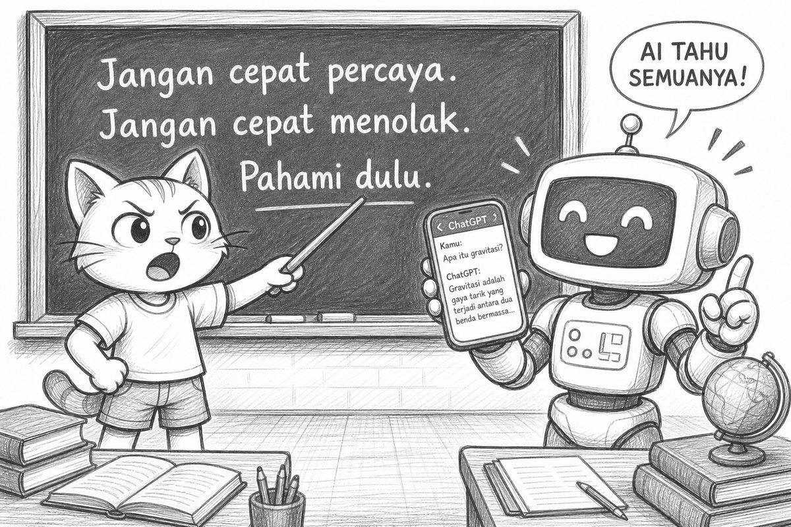
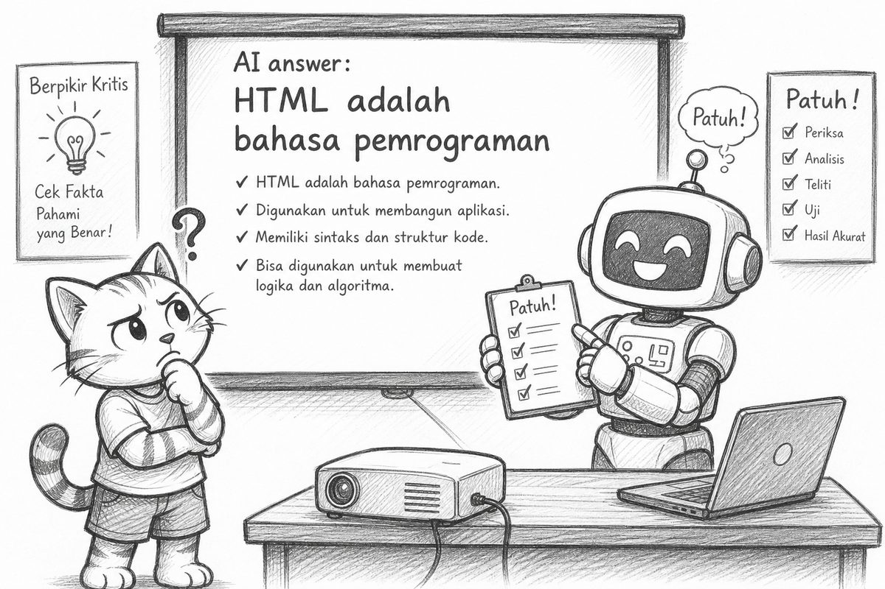
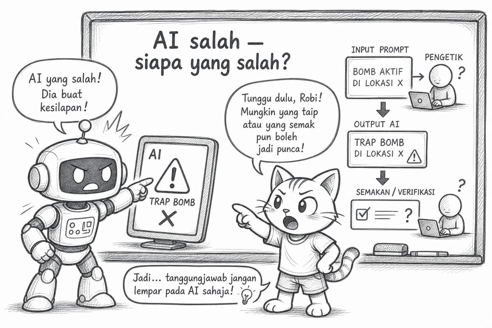
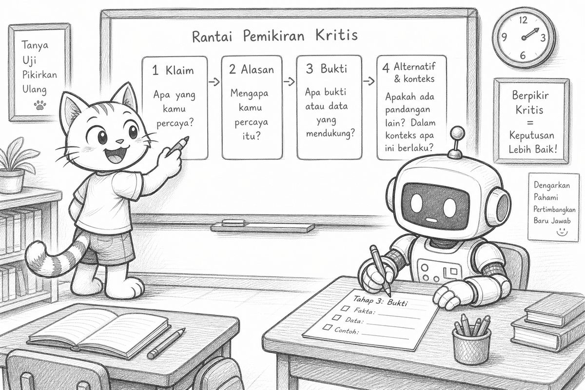
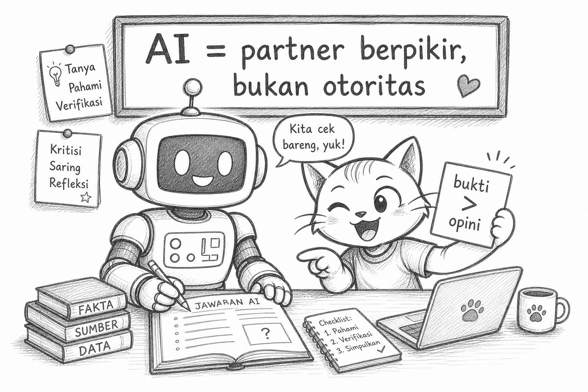
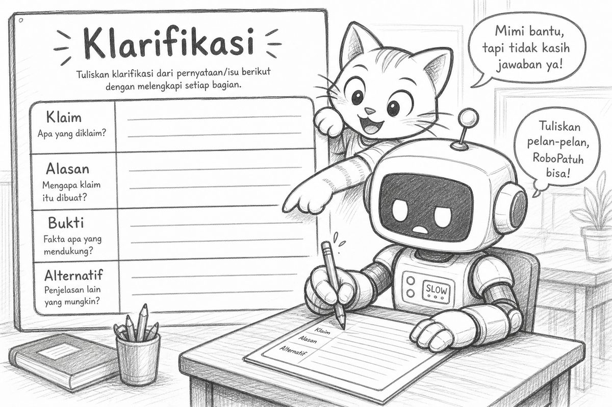
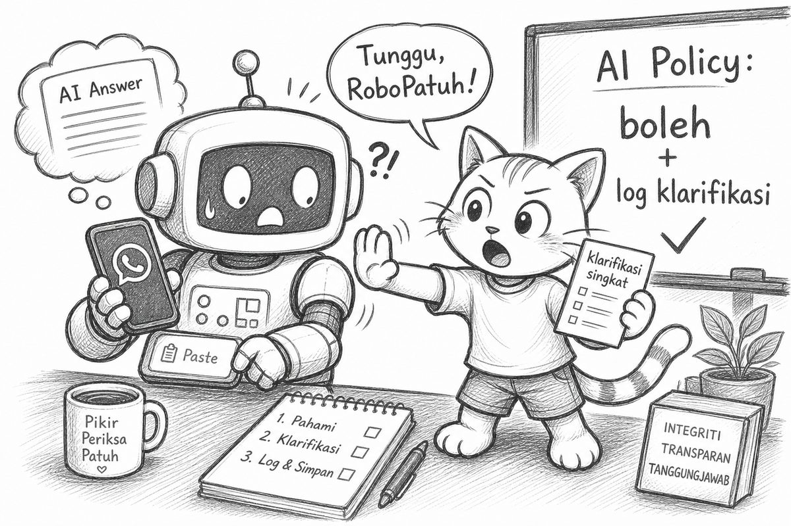

# Bacaan Pendamping — X-S1-P03  
## Mimi & Robi: ChatGPT Salah & Protokol Klarifikasi

| Field | Isi |
|-------|-----|
| Kode | X-S1-P03 — ChatGPT Salah & Protokol Klarifikasi |
| Pertemuan | 3 / 18 |
| Status | Naskah lengkap + ilustrasi dialog — PDF tersedia |
| Nada cerita | POV Mimi, ringan, Gen Z — **pola tetap** |
| PDF | [X-S1-P03_bacaan-mimi-robi.pdf](./X-S1-P03_bacaan-mimi-robi.pdf) |

**Handout konsep:** [X-S1-P03_chatgpt-klarifikasi_siswa.md](./X-S1-P03_chatgpt-klarifikasi_siswa.md)

---

Halo lagi. Mimi di sini.

Minggu lalu: Google bukan mind reader—**output = f(input)**.  
Robi sempat bilang ChatGPT juga “kayak dia.” Preview itu hari ini beneran.

Robi sudah buka chat AI sebelum kelas mulai.

> “AI pasti tahu. Lebih pintar dari kita.”

Aku tunjuk papan. Guru baru nulis moto:

```text
Jangan cepat percaya.
Jangan cepat menolak.
Pahami dulu.
```

> “Robi. Bukan ‘percaya total’. Bukan ‘tolak total’. **Pahami dulu.**”



---

## Learning Compass (5 menit)

| Arah | Hari ini |
|------|----------|
| **Tujuan** | Dari “AI bilang = benar/salah total” → klarifikasi (alasan, bukti, alternatif, konteks) |
| **Cara** | Lihat guru isi 1–2 langkah klarifikasi → baru worksheet berdua |
| **Peran kamu** | Baca klaim, uji, jangan copas jadi |
| **Dukungan** | Guru model Klaim + Alasan dulu |

```text
ORIENTASI  →  CONTOH GURU (scaffold)  →  BARU KAMU COBA
```

---

## Orientation: recall P01–P02

Guru singkat:

> “P02: output tergantung apa? P01: kenapa pahami dulu sebelum solusi?”

Jawaban yang diharapkan (bahasa kalian):

- P02 → **input / keyword**  
- P01 → biar gak nembak solusi prematur  

Hari ini sambungannya: prompt AI = input juga. Jawaban AI yang keren ≠ otomatis benar.

---

## Scaffold: guru model 2 langkah klarifikasi

Guru tampilkan **satu** kalimat klaim AI (belum full dump). Think-aloud:

1. **Klaim:** “HTML adalah bahasa pemrograman.”  
2. **Alasan:** “Karena ada tag `<>` dan dipakai di web — terdengar masuk akal.”  

**We do:** “Bukti apa yang bisa kita uji?” → kelas usul: coba cari `if` di HTML murni.

Robi:

> “AI udah jelasin. Selesai. Percaya aja.”

Aku:

> “Itu loncat. Kita baru model 2 langkah. Nanti baru full experience + worksheet.”

---

## Experience: AI plausibel tapi salah

Guru proyeksikan chat AI (live). Prompt kira-kira: *“Jelaskan apa itu HTML.”*  
(Lanjut dari scaffold — sekarang jawaban lengkapnya.)

Jawaban AI keluar meyakinkan banget:

```text
HTML adalah bahasa pemrograman karena:
  (a) dipakai membuat halaman web
  (b) punya sintaks dengan tanda <>
  (c) bisa dijalankan di browser
  KESIMPULAN: HTML setara dengan Python
```

Kelas: “Wah, masuk akal.”  
Robi centang checklist **Patuh!**:

> “AI bilang = benar. Selesai.”

Aku:

> “Plausibel ≠ benar. Argumen (a)–(c) itu… mengalihkan. Dipakai di web ≠ bahasa pemrograman.”



Uji cepat di kepala:

- Ada `if` / variabel / loop di **HTML murni**?  
- Kalau gak ada → klaim “setara Python” loncat logika.

(Versi absurb lain yang kadang muncul: AI nyuruh rebus mie dulu baru buka bungkus. Robi hampir ikut. Flashback P01/P04 vibes.)

---

## Trap: “AI salah — siapa yang salah?”

Guru bomb:

> “AI salah. **Siapa** yang salah?”

Debat 3 menit. Robi tunjuk layar:

> “AI-nya. Dia yang error.”

Aku tunjuk Robi + kotak prompt:

> “Atau… prompt-nya kurang? Atau kita terlalu percaya tanpa uji? Atau konteksnya hilang?”

Jawaban nuanced (bukan black-and-white):

- Kadang modelnya yang ngawur  
- Kadang **kita** yang nanya jelek / gak verifikasi  
- Kadang dua-duanya



---

## Clarify: rantai 4 langkah

Guru tulis di papan (TTS bareng kelas):

| Langkah | Pertanyaan |
|---------|------------|
| 1. **Klaim** | Apa yang dikatakan AI/teman/media? |
| 2. **Alasan** | Kenapa terdengar masuk akal? |
| 3. **Bukti** | Data/sumber/uji apa yang kita punya? |
| 4. **Alternatif & konteks** | Penjelasan lain? Kapan klaim **tidak** berlaku? |

Latihan 1× bareng klaim HTML tadi:

1. Klaim: HTML = bahasa pemrograman (setara Python)  
2. Alasan: terlihat coding, pakai `<>`, jalan di browser  
3. Bukti uji: coba cari `if` di HTML murni → gak ada  
4. Alternatif: HTML = bahasa **markup**; logika ada di JS. Konteks “bikin struktur halaman” ≠ “bikin program dengan kondisi”

Robi isi langkah 3 pelan-pelan. Progress.



---

## Concept: AI = partner, bukti > opini

Baru sekarang nama konsepnya:

- **Klarifikasi** = nanya alasan, bukti, alternatif, konteks—bukan langsung “benar” atau “salah total.”  
- **AI = partner berpikir**, bukan otoritas / pengganti otak.  
- **Bukti > opini** — termasuk opini yang terdengar pintar dari AI.



---

## Practice: worksheet pasangan

Guru kasih **1 klaim** (bukan file jawaban penuh). Kerja berdua. Isi sendiri:

1. Apa klaimnya?  
2. Apa **alasan** AI/teman bilang begitu?  
3. **Bukti** apa yang kita punya / bisa uji?  
4. **Alternatif** penjelasan?  
5. Dalam **konteks** apa klaim ini tidak berlaku?

Contoh klaim rotasi (aman, gak agama/politik):

| Klaim | Kenapa terdengar masuk akal | Cara uji |
|-------|----------------------------|----------|
| HTML = bahasa pemrograman | Tag, “kayak coding” | Bandingkan JS: ada `if`? |
| CSS buat logika bisnis | CSS powerful | Hitung total harga cuma pakai CSS? |
| “Semua virus dari download ilegal” | Narasi media | Counterexample + sumber |



Jangan copas jawaban teman. Rule kelas masih hidup.

---

## Reflect + AI Policy kelas

Refleksi:

> “Kapan pernah share info WA tanpa cek?”

Nyambung P01–P02: share tanpa pahami = solusi prematur.

**AI Policy** mulai hari ini:

- AI **boleh** dipakai **setelah** P03  
- Wajib **log klarifikasi singkat** (klaim → alasan → bukti → alternatif)  
- Copy-paste tanpa paham = belum lulus formatif **REA**

Robi hampir paste jawaban AI ke grup.

> “Udah diverifikasi AI—”

Aku tahan.

> “AI bukan verifikator. **Kamu**-nya yang klarifikasi.”



---

## Exit ticket

1. **1 pertanyaan klarifikasi** yang akan selalu kamu tanyakan (contoh: “Buktinya apa?” / “Dalam konteks apa ini gak berlaku?”)  
2. Bonus: satu asumsi yang kubongkar hari ini: …

---

## Cek cepat

1. Apa bedanya jawaban AI yang *plausibel* sama yang *benar*?  
2. Sebut 4 langkah rantai klarifikasi.  
3. “AI salah—siapa salah?” — kenapa jawabannya gak cuma “AI-nya”?  
4. AI Policy kelas: boleh pakai AI dengan syarat apa?

---

Satu line buat dibawa pulang:

> **Jangan cepat percaya. Jangan cepat menolak. Pahami dulu.**

Sampai P04—Robi janji gak masak mie dari jawaban AI tanpa klarifikasi. (Kita pantau.)

— **Mimi** 🐾  
*(Robi menulis di checklist: “Tanya bukti dulu.”)*

---

## Catatan produksi

- P03: materi pertemuan + ilustrasi dialog (`p03-01` … `p03-07`)  
- Learning Compass + Scaffold (v0.2) di awal bacaan  
- PDF: `X-S1-P03_bacaan-mimi-robi.pdf`  
- Regenerasi: `06-modules/materi-ajar/scripts/md_to_pdf_bacaan.py`
