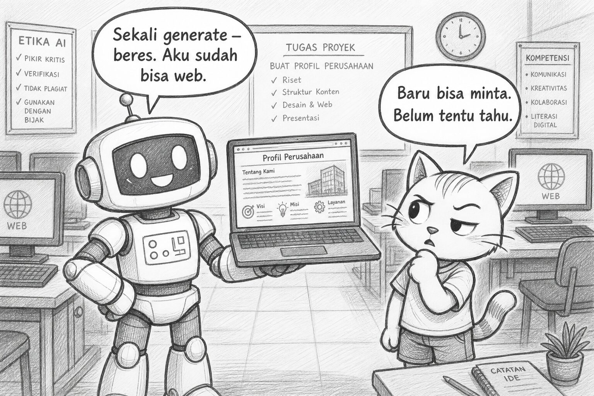
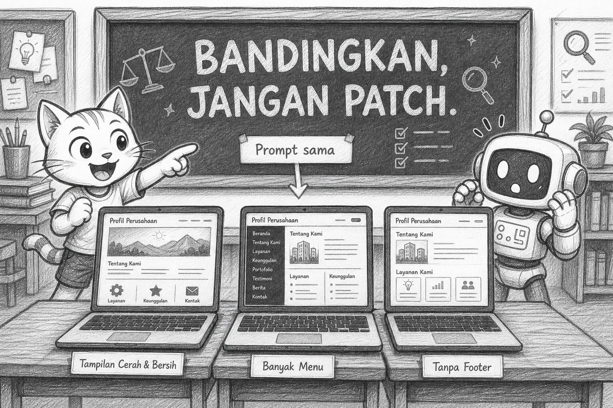
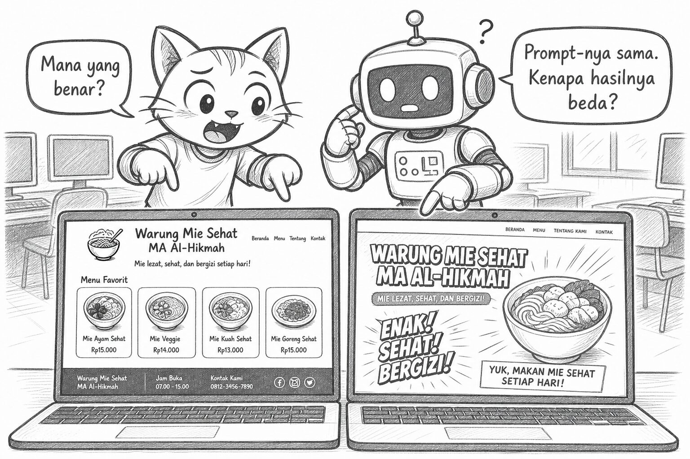
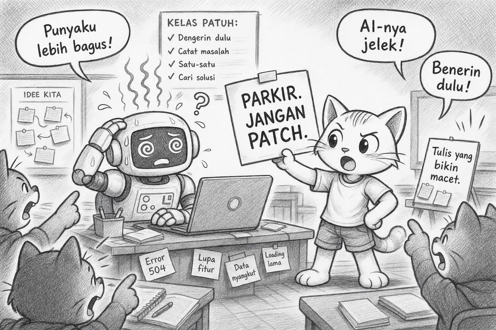
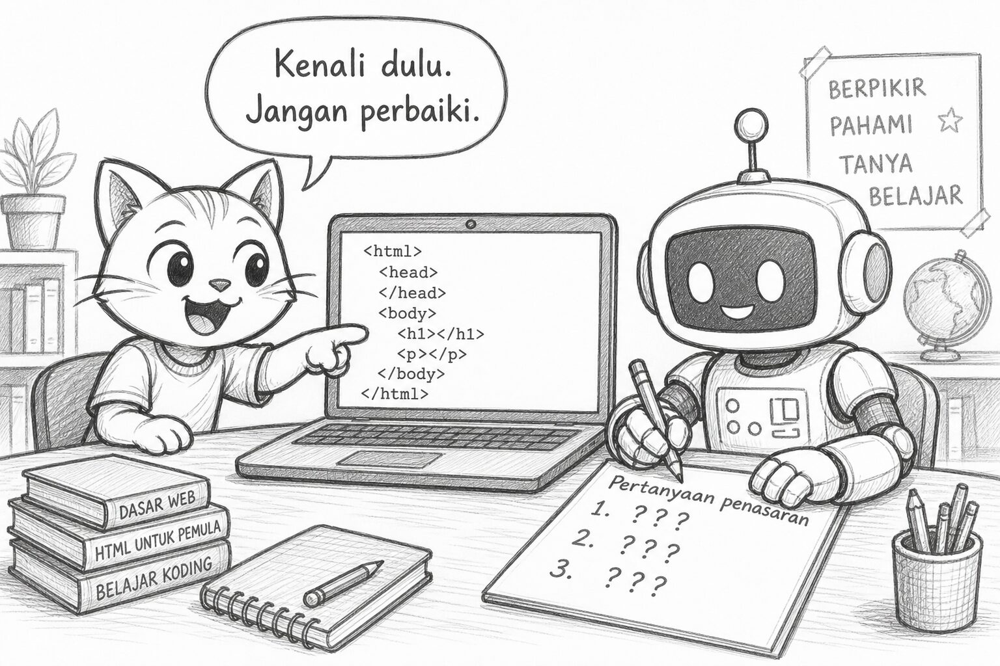
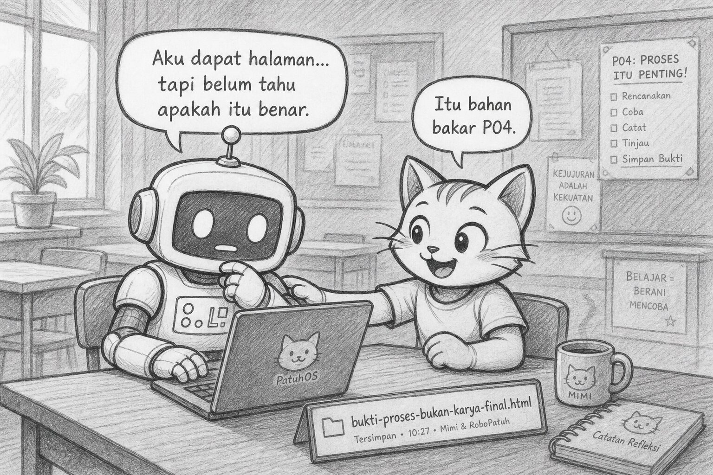

# Bacaan Pendamping — X-S1-P03  
## Mimi & Robi: Company Profile, Deadlock, & Rasa Penasaran

| Field | Isi |
|-------|-----|
| Kode | X-S1-P03 — Company Profile Impact |
| Pertemuan | **3 / 34** · Basis **4JP** |
| Status | Naskah + **6 sketch khusus impact 4JP** |
| Nada | POV Mimi, ringan, Gen Z |
| PDF | [X-S1-P03_bacaan-mimi-robi.pdf](./X-S1-P03_bacaan-mimi-robi.pdf) |

**Handout:** [X-S1-P03_company-profile-impact_siswa.md](./X-S1-P03_company-profile-impact_siswa.md)  
**Modul:** [X-S1-P03 …](../../../base-4jp/kelas-x/semester-1/X-S1-P03_company-profile-impact.md)

---

Halo. Mimi lagi.

Kemarin Robi bilang Google “salah.” Ternyata keyword-nya yang ambigu. Dia janji cek input dulu.

Hari ini dia bawa laptop dengan aura *main character*:

> “Aku minta AI bikinin company profile. Sekali generate — beres. Aku sudah bisa web.”

Aku:

> “Spoiler: kamu baru bisa **minta**. Belum tentu bisa **tahu**.”

---

## Learning Compass

Sebelum klik Generate, guru nulis di papan:

> **Bandingkan, jangan patch.**

| Arah | Hari ini |
|------|----------|
| Tujuan | Rasakan impact — bukan jadi ahli vibe coding |
| Peranmu | Generate → bandingkan → catat bingung |
| Bukan | Debug sampai cantik / paste ke WA sebagai karya final |

---

## Demo 1×

Guru generate **satu kali** dengan prompt yang sama untuk semua. File HTML keluar. Robi langsung:

> “Wah, ada judul, menu, kontak — ini website beneran.”

Aku tunjuk layar:

> “Ini **output**. Input-nya prompt itu. Ingat jaguar?”

---

## Experience — prompt seragam

Semua orang pakai prompt yang sama — soal Warung Mie Sehat MA Al-Hikmah. Satu file HTML. Tanpa “aku percantik dulu.”

Hasilnya… beda-beda.

Ada yang warna mencolok. Ada yang menu empat item rapi. Ada yang footer hilang. Ada yang teksnya kayak brosur hotel bintang lima padahal warung mie.

Robi:

> “Prompt-nya sama. Kenapa punya dia lebih keren?”

Aku:

> “Dan… mana yang **benar**?”

Diam. Productive awkward silence. Itu yang kita mau.

---

## Trap — deadlock

Kelas mulai ribut:

- “Punya aku lebih bagus.”  
- “Punya dia lebih lengkap.”  
- “AI-nya yang jelek.”  
- “Pak, benerin dulu dong.”

Guru:

> “Parkir. Jangan patch. Tulis apa yang bikin kalian macet.”

Deadlock bukan kegagalan. Deadlock = alarm: **kita belum punya cara menilai**, karena **kita belum paham yang kita minta**.

---

## Clarify (ringkas)

Yang hilang hari ini bukan “skill generate.”

Yang hilang:

1. **Paham** struktur halaman (nanti kita belajar baca tag)  
2. **Requirement** — minta apa sebenarnya? (P04)  
3. **Klarifikasi** ke AI & ke diri sendiri (P05)

AI kuat. Kita yang masih buta arah.

---

## Touch coding — kenali, jangan perbaiki

Guru tunjuk di satu file:

- `html` · `head` · `body` · `h1` · `p`

Bukan kuliah. Cuma nama + “kira-kira buat apa.”

Kamu buka file sendiri. Isi lembar kenali tag. Tulis **3 pertanyaan penasaran** — yang bukan “cara benerin CSS.”

Contoh bagus:

> “Kenapa ada yang di `head` dan ada yang di `body`?”

Contoh yang parkir dulu:

> “Pak, gantiin warnanya jadi biru dong.”

---

## Reflect

Robi akhirnya bilang pelan:

> “Aku bisa dapat halaman… tapi aku gak tahu apakah itu halaman yang **benar**.”

Aku:

> “Itu kalimat paling jujur hari ini. Simpan. Itu bahan bakar P04.”

---

## Exit

1. Satu kebingungan saat bandingkan hasil teman  
2. Satu pertanyaan supaya tidak generate buta  
3. Satu tag yang baru dikenal

Satu line dibawa pulang:

> **Generate tanpa paham = deadlock. Deadlock = undangan belajar — bukan malu.**

Sampai P04 — kita bahas “minta apa sebenarnya.”

— **Mimi** 🐾  
*(Robi menyimpan file HTML dengan nama `bukti-proses-bukan-karya-final.html`.)*

---

## Catatan produksi

- Ilustrasi: `assets/mimi-robi/p03-impact-01` … `p03-impact-06` (`.jpg`)  
- Aset `p03-01` … `p03-07` lama tetap disimpan sebagai arsip alur klarifikasi 2JP; **tidak dipakai** pada bacaan impact 4JP ini  
- PDF: `X-S1-P03_bacaan-mimi-robi.pdf` (generate 2026-08-16)  
- Regenerasi PDF: `06-modules/materi-ajar/scripts/md_to_pdf_bacaan.py`
