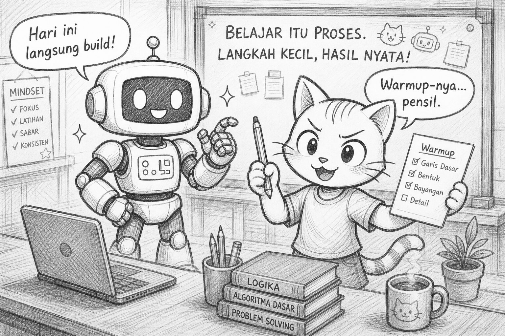
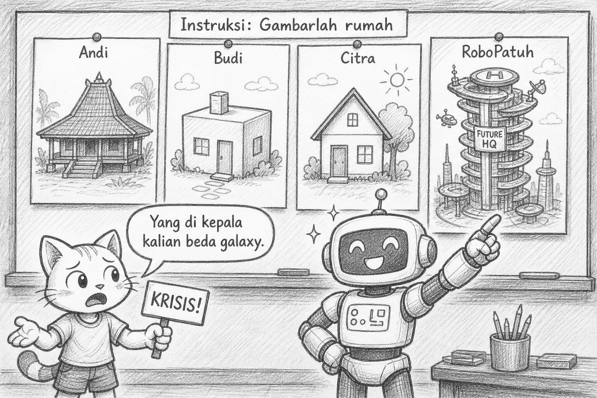
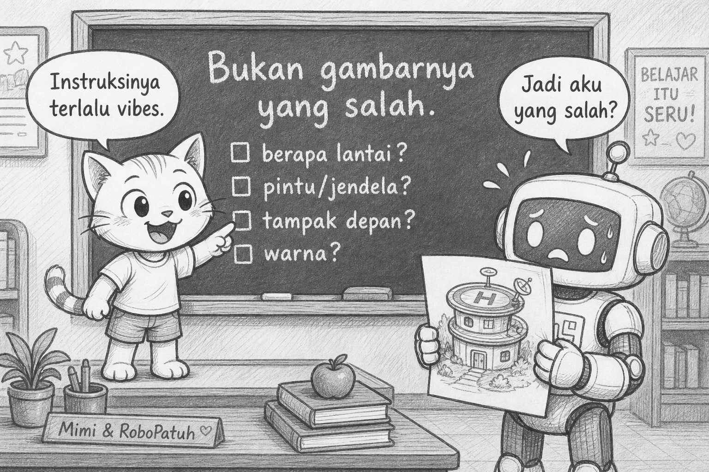
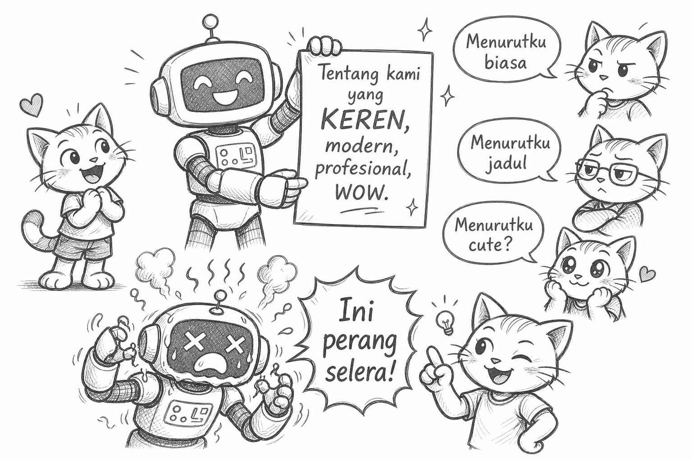
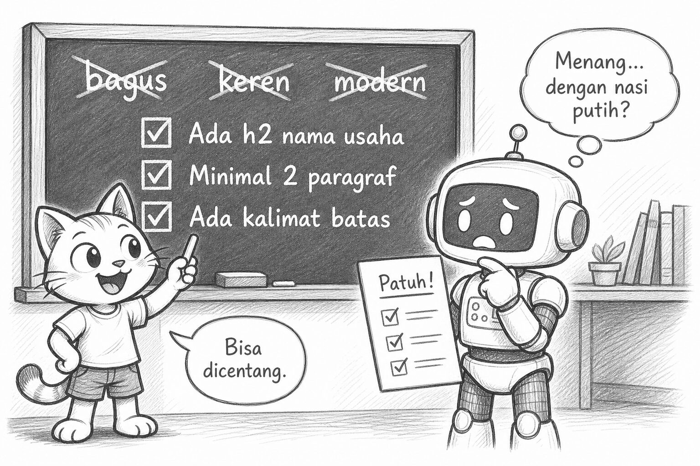
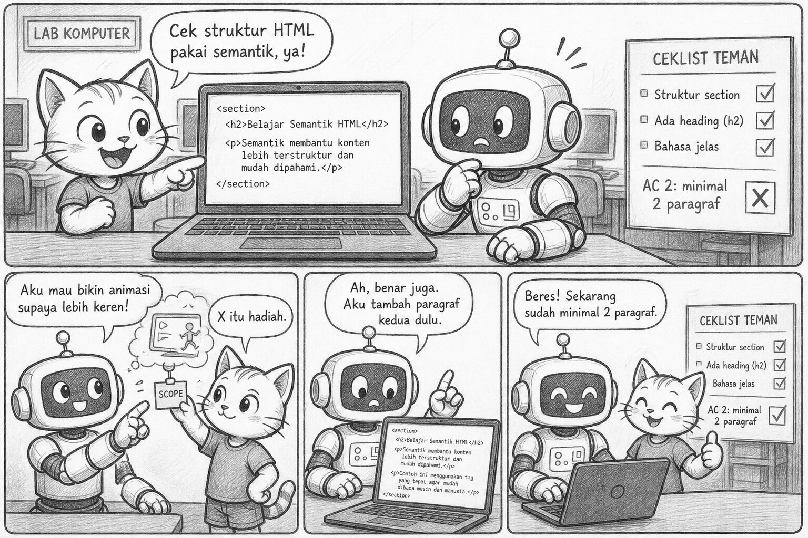
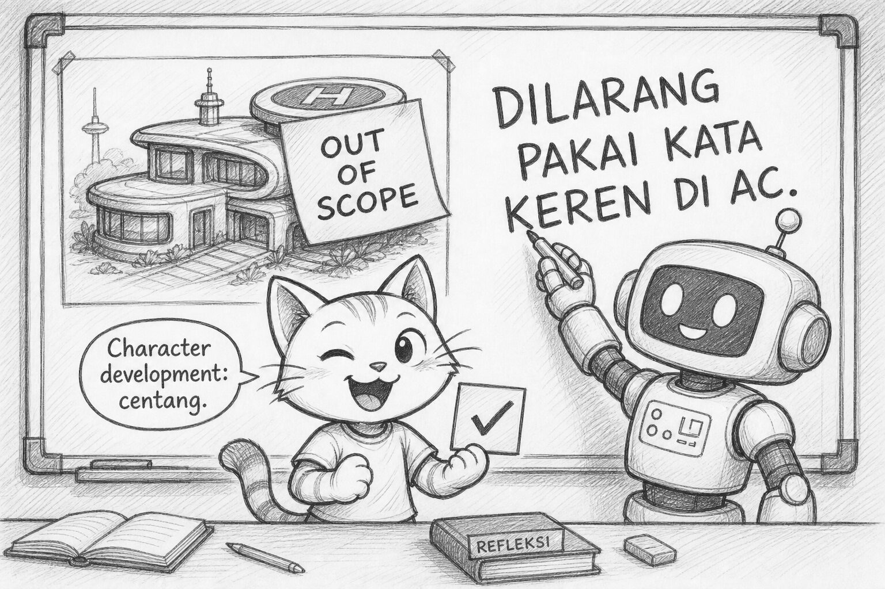

# Bacaan Pendamping — X-S1-P04  
## Mimi & Robi: Rumah yang “Salah”, Checklist yang Menyelamatkan, & Twist Kata KEREN

| Field | Isi |
|-------|-----|
| Kode | X-S1-P04 — Requirement & Acceptance |
| Pertemuan | **4 / 34** · Basis **4JP** |
| Status | Naskah humor + **7 sketch khusus requirement–acceptance** |
| Nada | POV Mimi, Gen Z, **plot twist** — teori dibungkus cerita |
| PDF | [X-S1-P04_bacaan-mimi-robi.pdf](./X-S1-P04_bacaan-mimi-robi.pdf) |

**Handout:** [X-S1-P04_gambar-rumah-requirement_siswa.md](./X-S1-P04_gambar-rumah-requirement_siswa.md)  
**Modul:** [X-S1-P04 …](../../../base-4jp/kelas-x/semester-1/X-S1-P04_gambar-rumah-requirement.md)

---

Halo. Mimi.

Kalau minggu-minggu ini terasa “banyak teori,” jangan panik. Ini bukan hukuman. Ini **bab awal journey software engineer** yang jarang ditayangin di trailer: sebelum hero ngetik kode keren, dia harus bisa bilang *apa yang diminta* tanpa bikin drama.

Robi hari ini masuk kelas dengan aura *final boss unlock*:

> “Akhirnya. Kemarin kita macet di company profile. Hari ini pasti **langsung build**. Aku sudah warmup jari.”

Aku:

> “Spoiler: warmup-nya… pensil.”



Layar di kepalanya lag 0,3 detik. Classic.

---

## Learning Compass (biar gak nyasar)

| Arah | Hari ini |
|------|----------|
| Tujuan | Spek spesifik + cara uji (bukan “bagus/keren”) |
| Peranmu | Gambar → sadar yang hilang → tulis AC → bangun 1 section |
| Bukan | Lomba gambar / full website / debat selera |

```text
LIHAT CONTOH  →  ALAMI AMBIGU  →  BARU TULIS SPEK  →  BARU BUILD
```

---

## Adegan 1 — Misi rahasia (yang ternyata pensil)

Guru:

> “Gambarlah rumah.”

Tiga menit. Kertas. Tanpa slide. Tanpa AI. Tanpa “boleh tanya detail?”

Robi *locked in*. Dia gambar… bukan rumah. Dia gambar **gedung 40 lantai + helipad + neon “FUTURE HQ”**, karena di kepalanya “rumah” = markas engineer masa depan.

Teman sebelah: joglo.  
Belakang: kotak + cerobong.  
Depan: cuma segitiga atap karena “ya rumah gitu.”

Pajang. Kelas diam. Lalu:

> “Instruksinya sama. Kok hasilnya kayak pameran seni yang lagi bertengkar?”

Aku angkat cakar:

> **KRISIS!** (versi lucu.)  
> “Yang sama cuma kalimatnya. Yang di kepala kalian — beda galaxy.”



Robi:

> “Jadi aku yang salah?”

> “Enggak. Instruksinya yang terlalu… *vibes*.”

---

## Plot twist #1 — “Salah” bukan karena jelek

Robi siap menerima nilai jelek. Dia sudah siapkan alasan:

> “Helipad itu inovasi—”

Guru:

> “Tidak ada yang dinilai cantik hari ini.”

Plot twist: **yang “salah” bukan gambarnya.**  
Yang goyah adalah asumsi:

> “Instruksi sama = hasil sama.”

Daftar bareng yang **tidak** diberikan:

- Berapa lantai?  
- Ada atap? pintu? jendela berapa?  
- Tampak depan atau denah?  
- Hitam-putih atau warna?  
- Rumah tinggal… atau markas dengan helipad? *(Robi mengangkat tangan pelan, lalu nurunin lagi.)*



Aku bisik:

> “Kemarin company profile deadlock. Hari ini versi kertasnya. Sama penyakitnya: **minta tanpa spek**.”

Robi pelan:

> “Jadi ‘gambar rumah’ itu… undangan chaos.”

> “Undangan interpretasi. Requirement itu yang bisa dijawab **ya / tidak**.”

---

## Adegan 2 — Dendam manis: “yang KEREN”

Setelah paham, Robi mau balas dendam ke ambiguitas. Dia tulis brief section web:

> **Tentang kami yang KEREN BANGET, modern, profesional, wow.**

Dia bangga. Empat kata power. Kayak trailer Marvel.

Teman tukar brief. Lima menit sketsa. Lalu centang acceptance.

Hasil review:

| Kriteria Robi | Hasil |
|---------------|-------|
| Keren banget | ❌ “Menurutku biasa.” |
| Modern | ❌ “Menurutku jadul.” |
| Profesional | ❌ “Menurutku cute?” |
| Wow | ❌ *(teman cuma ketawa)* |

Robi overheat:

> “Ini subjektif! Ini perang selera!”

Aku:

> “Exactly. Kau baru temukan musuh alami engineer: kata yang **terasa dalam**, tapi **tidak bisa dicentang**.”



---

## Plot twist #2 — Checklist “membosankan” yang menang

Guru coret kata **bagus / keren / modern** di papan (merah. Dramatis. Robi hampir minta tissue digital).

Lalu ubah bareng:

| Harapan (vibes) | Acceptance (bisa diuji) |
|-----------------|-------------------------|
| Section tentang kami yang keren | [ ] Ada `h2` berisi nama usaha |
| | [ ] Minimal 2 paragraf |
| | [ ] Ada 1 kalimat batas: “Kami tidak …” |

Robi terpaksa tulis ulang. Brief-nya sekarang… polos. Kayak nasi putih.

Teman sketsa lagi. Peer review:

> “AC 1 ✅ · AC 2 ✅ · AC 3 ✅”

Robi:

> “…menang? Dengan nasi putih?”

Aku:

> “Di dunia nyata, nasi putih yang bisa dicentang lebih berharga daripada trailer ‘wow’ yang bikin meeting 3 jam.”



Ini bagian journey engineer yang jarang difoto:  
**bukan anti-kreatif — anti-debat sia-sia.**  
Kreatif boleh. Tapi syarat tugas harus observable. Kalau tidak, yang menang = siapa paling keras bilang “kerasa keren.”

---

## Adegan 3 — Keyboard (1 section, bukan full saga)

Lanjut build: satu `<section>` sesuai spek. Bukan full page. Bukan CSS pelangi.

Robi hampir nambah animasi:

> “Sedikit saja—”

Aku:

> “Scope. Ingat P01. Helikopter antre kantin masih trauma kolektif.”

Peer:

> “AC nomor 2: ❌ — cuma satu paragraf.”

Robi mau debat. Aku tempel sticky di antenna-nya:

> “❌ itu hadiah. Lebih jujur dari ‘hmm lumayan, tapi…’”



Dia diam. Lalu nambah paragraf. Centang. Selesai.

Plot twist kecil terakhir: dia *senang* dapat ❌.  
Karena ❌ punya aturan. Bukan feeling.

---

## Reflect — bahasa buat deadlock kemarin

Sekarang P03 punya kamus:

1. **Ambiguitas** — banyak tafsir  
2. **Requirement** — apa yang harus ada  
3. **Acceptance** — cara bilang selesai tanpa perang selera  

Besok (P05): kalau spek masih bolong — **klarifikasi**. Jangan pura-pura “udah jelas di kepala.”

Robi nulis di margin (all caps, sedikit traumatized):

> DILARANG PAKAI KATA “KEREN” DI AC.

Aku:

> “Character development. Bagus— eh. Maksudku: ✅.”



---

## Exit (isi di kelas / PR singkat)

1. Poin requirement paling penting hari ini: …  
2. AC paling sulit dipenuhi: …  
3. Kata subjektif yang kamu “bunuh”: …

Satu line dibawa pulang:

> **Kalau tidak bisa dicentang, itu belum spek — itu harapan.**  
> Dan harapan tanpa spek = sumber bug sosial sebelum bug kode.

— **Mimi** 🐾  
*(Robi menutup helipad di gambarnya dengan sticky note: “out of scope.”)*

---

## Catatan produksi

- Ilustrasi: `assets/mimi-robi/p04-req-01` … `p04-req-07` (`.jpg`)  
- Aset `p04-01` … `p04-06` lama tetap disimpan sebagai arsip bacaan algoritma/mie; **tidak dipakai** pada bacaan requirement–acceptance ini  
- PDF: `X-S1-P04_bacaan-mimi-robi.pdf` (generate 2026-08-16)  
- Regenerasi PDF: `06-modules/materi-ajar/scripts/md_to_pdf_bacaan.py`
