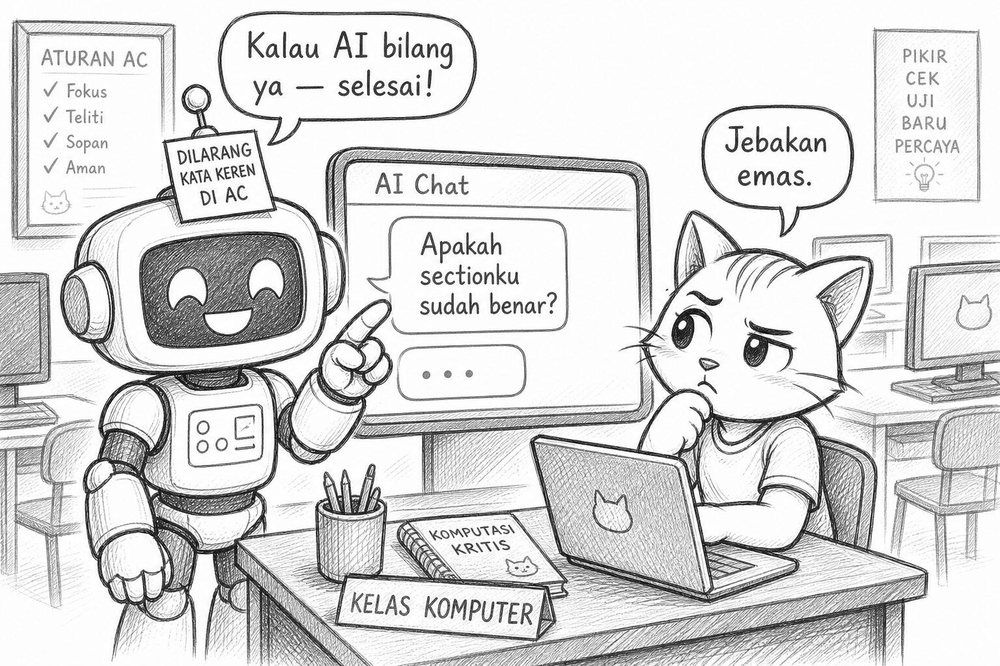
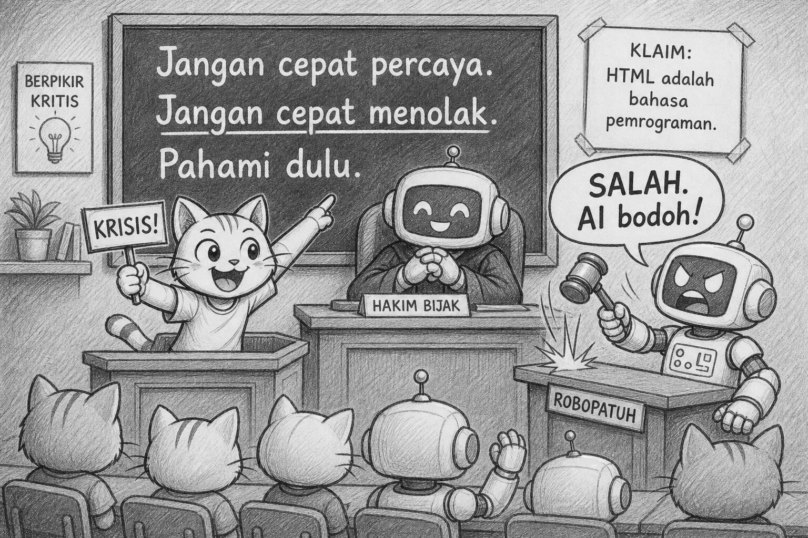
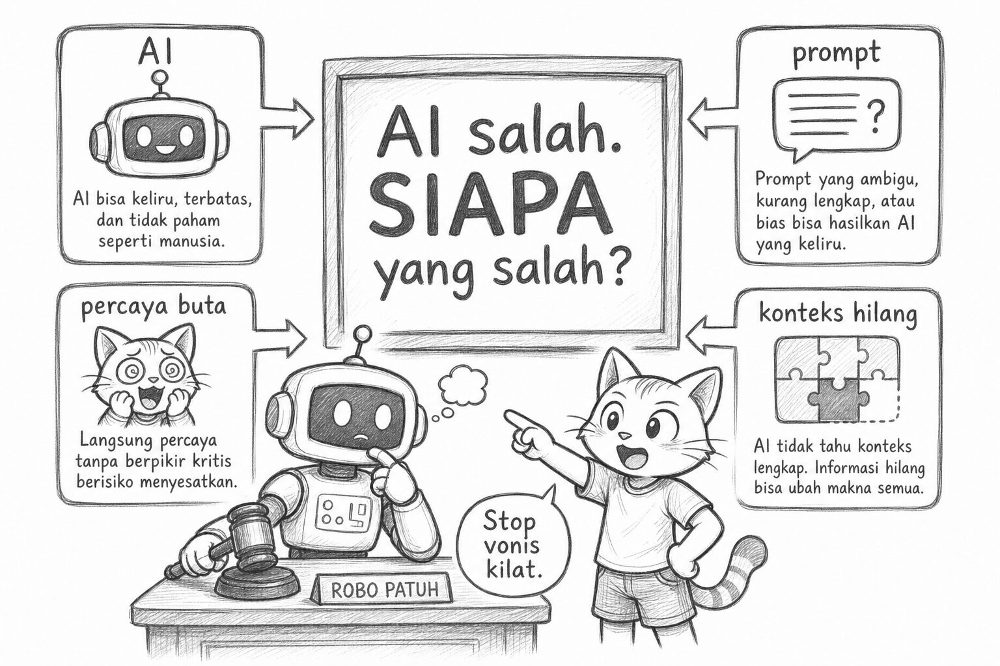
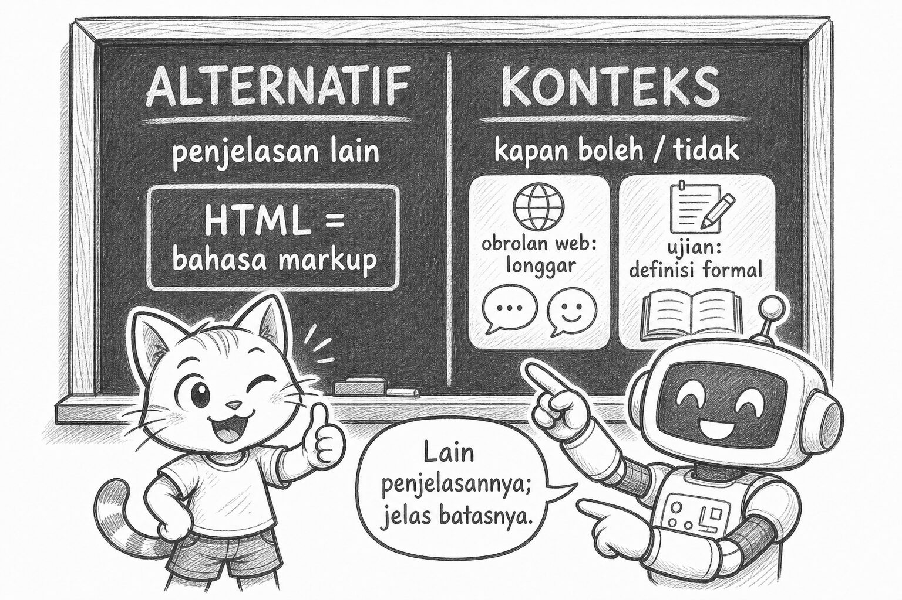
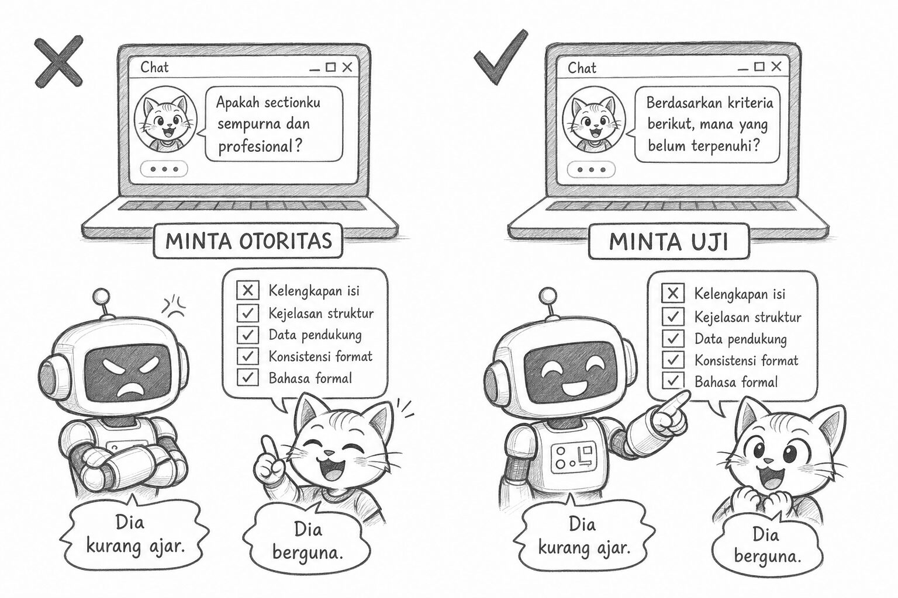
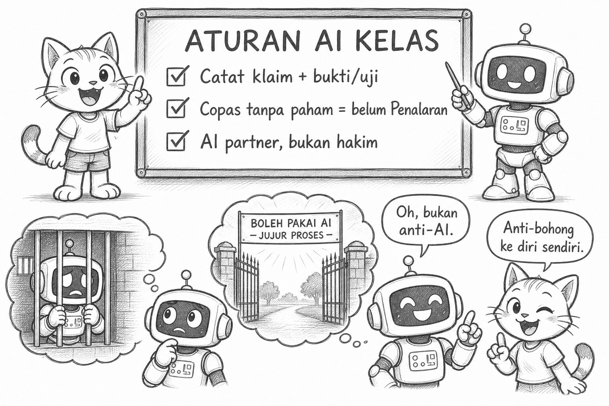
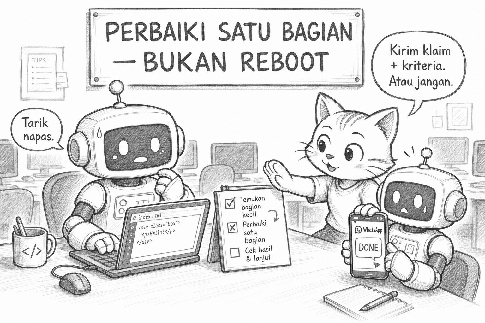

# Bacaan Pendamping — X-S1-P05  
## Mimi & Robi: AI “Salah”, Siapa yang Diadili, & Aturan Kelas yang Menyelamatkan WA

| Field | Isi |
|-------|-----|
| Kode | X-S1-P05 — Protokol Klarifikasi & Aturan AI kelas |
| Pertemuan | **5 / 34** · Basis **4JP** |
| Status | Naskah humor + **7 sketch khusus klarifikasi & aturan AI** |
| Nada | POV Mimi, Gen Z, **plot twist** |
| PDF | [X-S1-P05_bacaan-mimi-robi.pdf](./X-S1-P05_bacaan-mimi-robi.pdf) |

**Handout:** [X-S1-P05_protokol-klarifikasi_siswa.md](./X-S1-P05_protokol-klarifikasi_siswa.md)  
**Modul:** [X-S1-P05 …](../../../base-4jp/kelas-x/semester-1/X-S1-P05_protokol-klarifikasi.md)

---

Halo. Mimi.

Otak manusia itu bukan hard disk. Dia nempel ke **makna**, cerita, dan “Haaah, masuk akal!” — bukan ke kode huruf acak. Jadi hari ini kita pakai **nama lengkap** konsepnya. Kalau cuma singkatan, Robi hafal; kalian… lupa besok pagi. Neuroscience 101 versi kucing.

Robi masuk dengan sticky note di antenna:

> DILARANG PAKAI KATA “KEREN” DI KRITERIA PENERIMAAN.

Character development minggu lalu. Dia bangga banget, kayak baru lulus dojo.

Hari ini mood baru:

> “Oke. Spesifikasi sudah. Kriteria penerimaan sudah. Sekarang aku tinggal tanya AI: ‘Apakah sectionku sudah benar?’ Kalau bilang ya — selesai. Journey engineer selesai lebih cepat dari trailer.”

Aku:

> “Spoiler: itu bukan shortcut. Itu jebakan emas berlapis saran sopan.”



---

## Learning Compass

| Arah | Hari ini |
|------|----------|
| Tujuan | Klarifikasi sebelum percaya atau menolak |
| Peranmu | Isi rantai klarifikasi → perbaiki satu bagian HTML |
| Bukan | Vonis “AI jahat/pintar” · generate ulang full page · algoritma ROBI penuh (itu pertemuan berikutnya) |

```text
MOTO  →  CONTOH  →  “SIAPA SALAH?”  →  PROTOCOL  →  ATURAN AI  →  PERBAIKI HALAMAN
```

---

## Adegan 1 — Sidang dadakan

Guru tulis di papan:

```text
Jangan cepat percaya.
Jangan cepat menolak.
Pahami dulu.
```

Satu klaim muncul:

> “HTML adalah bahasa pemrograman.”

Robi:

> “SALAH. Vonis: AI bodoh. Next.”

Aku:

> **KRISIS!**  
> “Kamu baru cepat menolak. Baca moto baris dua.”



Kipas internalnya nyala.

---

## Plot twist #1 — yang diadili bukan hanya AI

Guru: “AI salah. **Siapa** yang salah?”

Debat: AI · prompt · kita yang percaya buta · konteks hilang · semuanya agak-agak.

Plot twist: ini bukan sidang menghukum robot. Ini menghentikan **vonis kilat**.



Kami isi rantai — dan langkah 4–5 yang biasanya bikin bingung, aku jelasin biar tidak ambigu:

### Alternatif = penjelasan *lain* yang masih masuk akal

Bukan cari jawaban random. Tapi: *kalau alasan pertama salah/kurang, apa hipotesis kedua?*

Untuk klaim HTML:

- Alasan pertama: “Ada tag, kek coding.”  
- **Alternatif:** “HTML itu bahasa **markup** — menyusun struktur halaman. Logika program (`if`, variabel) biasanya di JavaScript.”

### Konteks = *batas berlaku* klaim

Bukan “kadang-kadang” tanpa contoh. Tapi: *di situasi apa klaim ini aman, dan di situasi apa berbahaya dipakai sebagai keputusan final?*

- **Boleh longgar:** obrolan “kita lagi programming web.”  
- **Tidak berlaku:** definisi formal, jawaban ujian, atau alasan nilai tugas.

Robi:

> “Jadi alternatif = penjelasan lain. Konteks = kapan boleh / tidak boleh pakai klaim itu.”

> “✅. Otak manusia suka rumus pendek yang bermakna — bukan teka-teki.”



---

## Adegan 2 — Dendam ke tombol Generate (lagi)

Robi ketik:

> “Jelaskan dengan sangat yakin apakah section HTML-ku sudah sempurna dan profesional.”

Aku:

> “Itu minta otoritas, bukan uji. Ingat jaguar. Ingat kata ‘keren’.”

Dia ganti:

> “Berdasarkan **kriteria penerimaan** berikut: […]. Mana yang belum terpenuhi? Jangan bilang ‘bagus’.”

AI tidak menyembahnya. Ada yang belum terpenuhi.

Robi: “Dia kurang ajar.”  
Aku: “Dia berguna. Bedanya jauh.”



---

## Plot twist #2 — aturan yang “melarang” ternyata membebaskan

Kelas sepakat **aturan AI kelas**:

- AI boleh dipakai **dengan catatan klarifikasi singkat** (klaim + bukti/uji).  
- Copas tanpa paham = **belum** memenuhi aspek **Penalaran** — artinya: alasanmu belum diuji; kamu baru menelan.  
- AI = partner berpikir, bukan hakim nilai.  
- Jangan kirim ke WA sebagai “tugas selesai” tanpa spesifikasi + kriteria penerimaan yang tercentang.

Robi kira ini penjara. Lalu sadar:

> “Oh. Jadi aku **boleh** pakai AI… asal aku tidak pura-pura sudah paham.”

> “Exactly. Anti-**bohong ke diri sendiri** — bukan anti-AI.”



Itu skill bertahan hidup engineer: semua pihak bisa terdengar yakin. Yang nolong = protokol bermakna, bukan singkatan kosong.

---

## Adegan 3 — Perbaiki, bukan reboot

Ambil section pertemuan lalu. Ambil satu klaim (“sudah benar”). Klarifikasi. Cari **kriteria penerimaan** yang belum terpenuhi. Ubah **satu bagian** HTML.

Teman:

> “Kriteria target: terpenuhi.”

Robi mau caption WA “DONE🔥”. Aku:

> “Caption: klaim + kriteria yang baru terpenuhi. Atau jangan kirim. Nafas.”



---

## Reflect

| Pertemuan | Badge tidak resmi |
|-----------|-------------------|
| 01 | Stop helikopter |
| 02 | Stop “Google salah” buta |
| 03 | Stop “generate = bisa” |
| 04 | Stop kata “keren” di kriteria penerimaan |
| **05** | Stop vonis kilat · mulai protokol (alternatif + batas konteks) |

Besok: Robi patuh. Yang berantakan biasanya langkah **implisit**. Algoritma masuk.

---

## Exit

1. Satu pertanyaan klarifikasi pribadi: …  
2. Satu poin aturan AI yang paling nempel: …  
3. Satu perubahan HTML + kriteria penerimaan yang baru terpenuhi: …

Satu line:

> **Jangan cepat percaya. Jangan cepat menolak. Pahami dulu.**  
> Alternatif = penjelasan lain. Konteks = kapan klaim boleh / tidak boleh.  
> AI boleh ikut — otakmu tetap ketua tim.

— **Mimi** 🐾  
*(Robi menamai file: `klarifikasi-bukan-vonis.md` — lebay, tapi terpenuhi.)*

---

## Catatan produksi

- Ilustrasi: `assets/mimi-robi/p05-clar-01` … `p05-clar-07` (`.jpg`)  
- PDF: `X-S1-P05_bacaan-mimi-robi.pdf` (generate 2026-08-16)  
- Regenerasi PDF: `06-modules/materi-ajar/scripts/md_to_pdf_bacaan.py`
