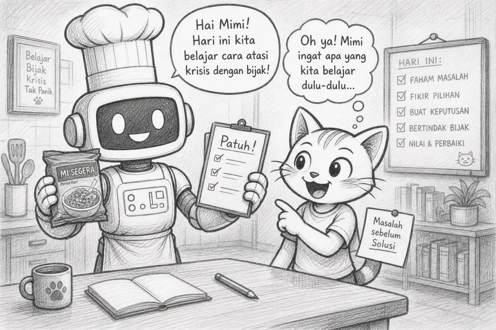

# Bacaan Pendamping — X-S1-P06  
## Mimi & Robi: Mie Berbungkus, Robot Patuh, & Algoritma yang Menyelamatkan Niat

| Field | Isi |
|-------|-----|
| Kode | X-S1-P06 — ROBI & Algoritma |
| Pertemuan | **6 / 34** · Basis **4JP** |
| Status | Naskah humor · istilah penuh · sketch aset p04* bisa dipakai |
| Nada | POV Mimi, Gen Z, **plot twist** |

\*Aset `assets/mimi-robi/p04-*.jpg` (mie/ROBI) dari materi lama — nama folder historis, isinya cocok drama hari ini.

**Handout:** [X-S1-P06_robot-mie-algoritma_siswa.md](./X-S1-P06_robot-mie-algoritma_siswa.md)  
**Modul:** [X-S1-P06 …](../../../base-4jp/kelas-x/semester-1/X-S1-P06_robot-mie-algoritma.md)

---

Halo. Mimi.

Robi hari ini *extra shiny*. Dia baru lulus dojo klarifikasi kemarin. Sticky note di antenna sekarang dua:

> 1. Dilarang kata “keren” di kriteria penerimaan.  
> 2. Jangan cepat percaya. Jangan cepat menolak.

Dia bilang:

> “Hari ini aku siap. Spek sudah. Klarifikasi sudah. Tinggal… **masak**. Aku robot. Masak = eksekusi. Easy.”

Aku:

> “Spoiler: ‘easy’ adalah kata paling berbahaya sebelum algoritma.”



---

## Learning Compass

| Arah | Hari ini |
|------|----------|
| Tujuan | Instruksi eksplisit berurutan = **algoritma** |
| Peranmu | Lihat ROBI gagal → tulis langkah → uji teman literal → tulis di HTML |
| Bukan | Menyalahkan yang jadi ROBI · kuliah flowchart rumit · CSS pelangi |

```text
CONTOH TEH  →  DRAMA MIE  →  “PATUH TAPI GAGAL?”  →  NAMA: ALGORITMA  →  TULIS + UJI
```

---

## Adegan 1 — Pemanasan: teh yang “sudah jelas”

Guru tulis tiga langkah:

1. Buat teh.  
2. Maniskan.  
3. Selesai.

Robi angkat antenna:

> “Jelas. Aku paham.”

Aku:

> “Kamu *merasa* paham. Otak manusia suka merasa. Mesin tidak.”

Kelas tambah langkah yang hilang: gelas bersih, air mendidih, teh masuk dulu atau sesudah, aduk, cek rasa…


---

## Adegan 2 — Boss fight: mie instan

Instruksi ke ROBI (patuh total):

1. Panaskan air.  
2. Masukkan mie.  
3. Aduk.  
4. Selesai.

**DUMP.**  
Mie masuk — **masih dalam bungkus**.

Kelas meledak. Robi bangga:

> “Aku patuh. Checklist terpenuhi. Empat dari empat.”

Aku pegang papan **KRISIS!** (versi lapar):

> “Betul. Kamu patuh. Hasilnya tetap bencana. Itu plot twist favorit dunia pemrograman.”


---

## Plot twist #1 — yang bersalah bukan kepatuhan

Debat klasik:

- “ROBI bodoh.”  
- “Mie-nya jelek.”  
- “Guru jebakan.”

Twist: **kepatuhan bukan bug.**  
Bug-nya: langkah **kupas bungkus** tidak pernah jadi instruksi. Itu langkah **implisit** — manusia kerjakan diam-diam, lalu marah saat mesin tidak menebak.

Robi pelan:

> “Jadi… aku tidak salah karena nurut?”

> “Kamu salah kalau mengaku ‘paham niat’. Kamu benar kalau nurut pada yang **tertulis**.”

Ini jembatan P02–P05: input, spek, klarifikasi — semua melawan ilusi “yang dimaksud.”

---

## Concept — nama resmi hari ini

Guru tulis besar:

> **Algoritma** = urutan langkah yang **eksplisit**, **berurutan**, dan **dapat dijalankan** tanpa menebak niat.

Bukan mantra. Bukan singkatan aneh. Nama yang bermakna — biar nempel di otak, bukan cuma di hafalan robot.


Robi:

> “Jadi algoritma = anti-telepati.”

> “Marketing-mu bagus. Simpan.”

---

## Adegan 3 — Balas dendam yang sehat

Robi tulis algoritma **buat teh** delapan langkah. Tukar. Teman jadi ROBI literal.

Teman gagal di langkah 3 karena Robi lupa “siapkan gelas bersih.”

Robi mau marah. Aku:

> “Itu hadiah Observasi. Lebih berharga dari pujian ‘keren’.”

Dia revisi. Uji lagi. Lolos.

Lalu keyboard: `algoritma.html` — daftar berurutan. Baca keras baris demi baris. Seperti program.


---

## Plot twist #2 — “menulis langkah” bukan anti-kreatif

Robi bilang:

> “Ini membosankan. Engineer kan kreatif.”

Aku:

> “Kreatif tanpa langkah jelas = helipad di tugas gambar rumah. Ingat?”

Twist: algoritma **membebaskan** kreativitas di tempat yang aman — karena yang harus sama (langkah kritis) sudah disepakati. Sisanya baru gaya.

Di journey software engineer, ini bab yang jarang masuk trailer: sebelum fitur keren, ada daftar yang tidak boleh menebak.


---

## Reflect

| Pertemuan | Badge tidak resmi |
|-----------|-------------------|
| 01 | Stop helikopter |
| 02 | Stop “Google salah” buta |
| 03 | Stop “generate = bisa” |
| 04 | Stop “keren” di kriteria penerimaan |
| 05 | Stop vonis kilat |
| **06** | Stop telepati ke mesin · mulai algoritma |

Besok (P07): halaman web juga butuh **nama bagian yang jelas** — HTML semantik. Bukan cuma “div misterius.”

---

## Exit

1. Satu langkah yang wajib ditulis eksplisit: …  
2. Satu langkah boleh dibalik vs tidak: …  
3. Satu kalimat: algoritma ≠ menebak niat — …

Satu line:

> **Patuh pada instruksi buruk tetap bisa gagal.**  
> Obatnya bukan marah ke mesin — **tulis langkah yang tadinya implisit.**

— **Mimi** 🐾  
*(Robi menamai file: `algoritma-anti-telepati.html` — lebay, tapi langkahnya eksplisit.)*
