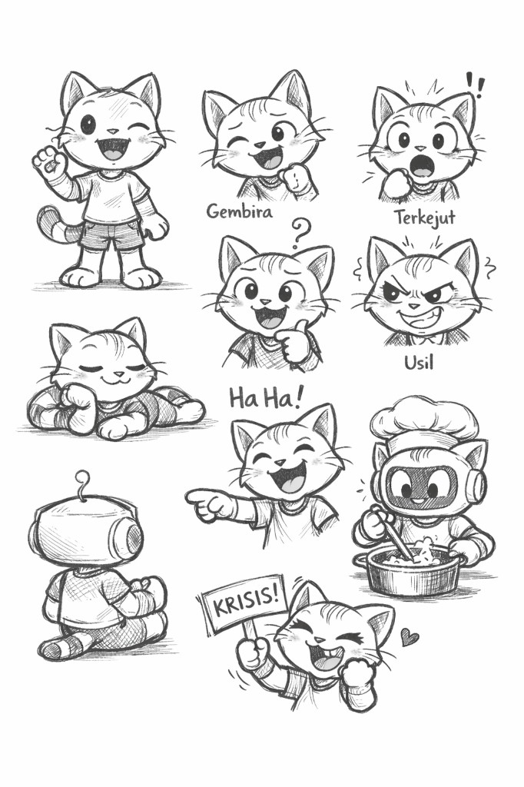
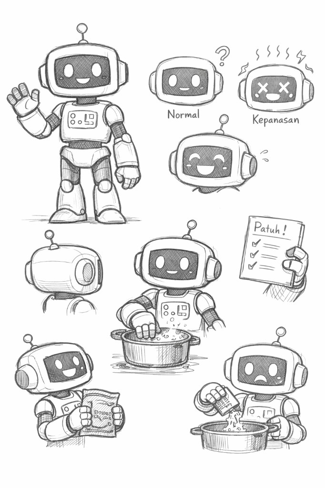
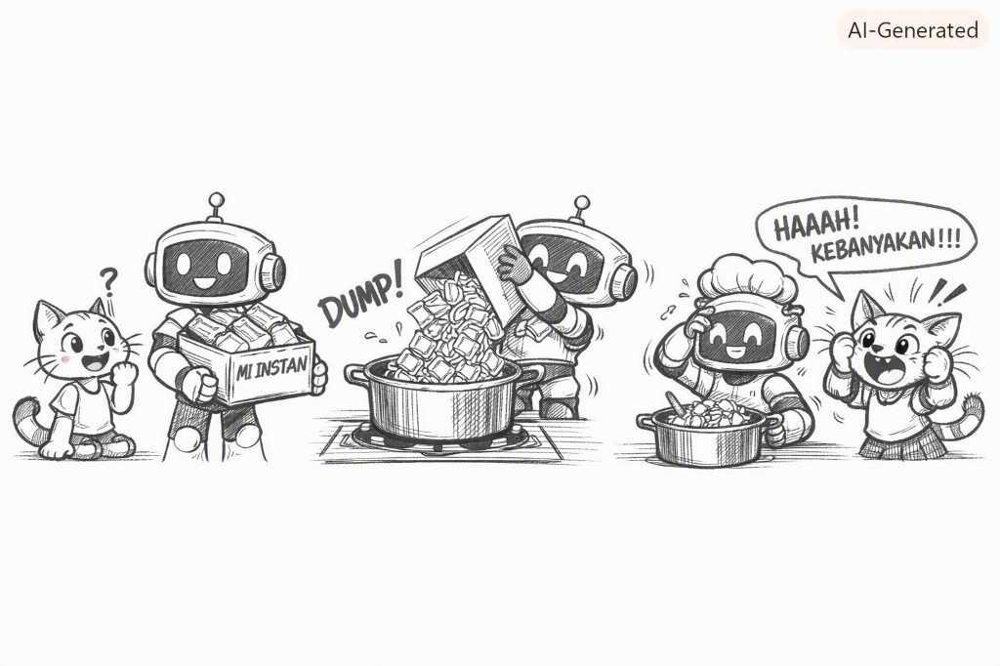

# Bacaan Pendamping — X-S1-P01  
## Mimi & Robi: Perkenalan + Masalah Sebelum Solusi

| Field | Isi |
|-------|-----|
| Kode | X-S1-P01 — Masalah Sebelum Solusi |
| Bagian | **1–4** — Perkenalan (1–3) · Materi pertemuan (4) |
| Status | Naskah lengkap — PDF tersedia |
| Nada cerita | POV Mimi, ringan, Gen Z — **pola tetap** untuk bacaan berikutnya |
| PDF | [X-S1-P01_bacaan-mimi-robi.pdf](./X-S1-P01_bacaan-mimi-robi.pdf) |

**Handout konsep:** [X-S1-P01_masalah-sebelum-solusi_siswa.md](./X-S1-P01_masalah-sebelum-solusi_siswa.md)

---

Halo.

Aku **Mimi**.  
Dan ini—tunggu, jangan panik, dia ramah kok—**Robi**. Nama lengkapnya RoboPatuh. Si robot yang… ya, patuh banget. Kadang *terlalu* patuh. Nanti aku ceritain.



Kalian baru masuk kelas Multimedia, kan? Santai. Ini bukan sesi “hafalin definisi sampai pusing.” Kita kenalan dulu. Kayak nonton trailer sebelum filmnya.

---

## Oke, aku dulu

Aku kucing. Jelas, kan? Dua kaki, kaos biasa, ekor belang, mata gede. Spesialisisku: **komentar**.

Kalau ada yang aneh, aku bilang.  
Kalau ada yang absurd, aku ketawa.  
Kalau ada yang “sebentar… ini gak masuk akal,” aku yang pertama angkat tangan—eh, angkat cakar.

Orang bilang aku “penonton kritis.” Keren juga sih kedengarannya. Intinya: aku suka nanyain yang janggal, biar kalian *ingat*. Karena jujur aja—otak manusia lebih nempel ke hal lucu / cringe / “HAAAH!” daripada slide PowerPoint 40 halaman.

Jadi kalau nanti aku usil atau teriak “KRISIS!”, itu bukan bully. Itu alarm. Versi lucu.

---

## Terus ini Robi



Robi punya kepala kayak TV jadul, antenna kecil, senyum di layar yang hampir *selalu* nyala. Dada ada tombol-tombol. Tangannya empat jari. Vibes-nya: “Siap terima perintah.”

Dia dibikin biar bantu manusia. Masalahnya: **Robi gak nalar. Dia eksekusi.**

Kasih checklist “Patuh!” → dia centang.  
Biliang “lakukan A, B, C” → dia lakukan A, B, C.  
Gak nanya “emang masalahnya apa?” Gak nanya “ini masuk akal gak?”

Kadang layarnya X + kepanasan.  
Kadang keringetan digital.  
Tapi selama perintah belum kelar? Dia lanjut. Full commit.

Bayangin teman yang nurut banget… tanpa filter. Itu Robi.

---

## Cerita yang viral di kota kami (spoiler: cringe)



Suatu hari ada yang bilang ke Robi:

> “Masukkin mie ke panci.”

Simple, kan?

Robi bawa dus **MI INSTAN**. Aku udah pasang tanda tanya di kepala. Naluri kucing bilang: *ini bakal chaos.*

Terus—**DUMP!**

Seluruh bungkus masuk panci. Masih plastik. Masih utuh.  
Robi pakai topi koki, garuk-garuk kepala, senyum bingung.

Aku:

> “HAAAH! KEBANYAKAN!!!”

Secara *patuh*? Dia juara.  
Secara “bisa dimakan”? …nope.

Dan tau gak? Cerita ini nempel. Orang masih cerita ulang. Itu gunanya kejadian absurd—biar otak kalian gak autofill “ya udah, jalanin aja” tanpa mikir.

*(Nanti cerita mie bakal balik lagi di pertemuan lain. Hari ini cukup: kalian kenal siapa aku, siapa dia.)*

---

## Kenapa kami “nempel” di kelas kalian?

Simpel:

- Lagi buru-buru kasih solusi tanpa paham masalah? → Itu mode **Robi**. Centang “Patuh!” dulu, mikir belakangan.  
- Lagi ngerasa “wait, ini aneh banget”? → Hidupin mode **Mimi**. Komentarin. Tanyain.  
- Guru bukan nyari siapa yang paling cepat “selesai.” Yang dilatih: **cara mikir**. Coding nanti—itu medianya, bukan tujuan utamanya.

Satu line buat dibawa pulang:

> **Kita latihan berpikir. Coding cuma tools.**

Oke. Kenalan selesai.  
Sekarang yang penting: *cara* kita belajar di kelas ini—plus misi hari ini: **masalah sebelum solusi.**

---

# Bagian 2 — Cara kita belajar (+ misi: masalah dulu)

Halo lagi. Masih aku.

Di kelas ini, guru jarang buka dengan “Oke, hafalin definisi ini.”  
Biasanya malah: kasih situasi → kalian cobain mikir → baru kasih nama konsepnya.

Kayak gini alurnya (simpelin aja, gak usah hafal istilahnya):

```text
ngalamin dulu  →  ketahuan asumsi  →  klarifikasi
       →  baru nama konsep  →  latihan  →  refleksi  →  “dipakai di mana lagi?”
```

Robi dengar itu, langsung angkat tangan (secara robot):

> “Berarti langkah 1: buat aplikasinya?”

Aku:

> “Robi. Baru kenalan. Sudah mode solusi. Classic.”

Itu dia trap-nya. Dan hari ini trap itu yang kita bedah.

---

## Misi hari ini: stop dulu sebelum “solusi”

Bayangin ini: di sekolah ada **antre kantin**. Panjang. Bikin kesel. Banyak yang bilang “kantin-nya jelek.”

Guru bilang ke Robi:

> “Ada masalah di kantin. Selesaikan.”

Robi centang checklist **Patuh!** lalu keluarin solusi kilat:

1. Beli helikopter antar-jemput ke kantin.  
2. Tutup sekolah biar gak ada yang antre.  
3. Bikin **50 aplikasi** antrean beda-beda—tanpa nanya petugas kantin.

Aku pegang papan **KRISIS!** sambil ketawa digigit.

> “Robi. Helikopter itu *bisa* dibeli di dunia fiksi. Tapi… masalah aslinya apa, sih?”

Dia senyum di layarnya. Checklist-nya hijau. Baginya: *selesai.*

Bagi kalian: solusi bisa keren, bisa teknis, bisa “executable”—tapi **gagal** kalau masalahnya belum dibatasi. Kayak masukin mie berbungkus: perintah jalan, hasilnya… bukan yang mau.

---

## Trap favorit kelas (seriusan sering kejadian)

Di kepala banyak orang (termasuk aku kadang, hehe), alurnya otomatis:

> Ada masalah → **buat app / web / sistem.**

Stop.

Teknologi itu *salah satu* jalan. Bukan default.  
Kadang yang dibutuhkan justru: komunikasi, aturan giliran, observasi dulu, atau… nanya ke orang yang terdampak.

Jadi kalau di kelompok nanti ada yang langsung bilang “kita bikin aplikasinya aja,” itu bukan salah total—itu **asumsi**. Dan asumsi boleh diuji.

Protokol kecil yang mulai hari ini:

> **Pahami sebelum menyimpulkan.**

Bukan “jangan punya ide.”  
Tapi: jangan *nikah* sama ide sebelum masalahnya jelas.

---

## Tiga pertanyaan biar gak mode Robi

Sebelum usul solusi (app, poster, aturan baru, apapun), coba isi ini dulu—bahasa manusia, bukan bahasa robot:

| Tanya | Contoh jelek | Contoh lebih niat |
|-------|--------------|-------------------|
| **Masalahnya apa?** (kondisi nyata, bukan cuma “kesel”) | “Kantin jelek” | “Antre kantin >15 menit di istirahat, udah 3× minggu ini” |
| **Siapa yang paling kena?** | “Semua orang” | “Siswa kelas X yang beli; petugas kantin” |
| **Batasnya apa?** (apa yang *sengaja* gak kita selesaikan dulu) | *(kosong)* | “Gak ubah menu; gak nambah stall; fokus antre aja” |
| **Masih belum tahu apa?** | *(kosong)* | “Antre karena bayar lambat… atau makanan keluarmya lambat?” |

Itu namanya **problem framing**—nulis masalahnya dulu biar gak nembak solusi ke target yang salah.

- **Stakeholder** = siapa yang benar-benar kesulitan (bukan “semua” generik).  
- **Scope / batas** = apa yang masuk minggu ini, apa yang diparkir dulu biar proyek gak meledak.

Bukti juga penting. “Antre panjang” itu opini kalau gak ada: kapan? berapa menit? siapa yang ngukur?

---

## Jadi, di kelas hari ini kalian bakalan…

1. Nulis 1 masalah nyata (yang beneran ngeganjel).  
2. Liat solusi absurd (iya, termasuk yang helikopter) — tanya: *kenapa gagal?*  
3. Kelompok: fokus **siapa / batas / apa yang bukan tugas kita** — bukan langsung desain app.  
4. Kalau ada yang loncat ke “bikin web,” guru bakal nanya balik: *masalahnya apa? butuh teknologi?*  
5. Isi template 1 halaman: Masalah · Siapa · Batas · Pertanyaan terbuka.  
6. Refleksi: kapan pernah salah solusi karena buru-buru?  
7. Bonus transfer: share hoaks di WA tanpa cek = versi lain dari “solusi prematur.” Nanti nyambung ke pertemuan berikutnya.

Robi lagi nulis di checklist-nya: *“Buat app dulu—”*  
Aku coret. Ganti:

> **Pahami dulu. Baru usul.**

---

## Cek cepat — Bagian 1 (kenalan)

1. Kalau disuruh jelasin Robi ke temen sebangku, kamu bilang apa?  
2. Kenapa cerita mie berbungkus lebih gampang diingat daripada definisi panjang?  
3. Kapan terakhir kamu “mode Robi”—nurutin sesuatu tanpa nanya dulu?

## Cek cepat — Bagian 2 (hari ini)

1. Kenapa “beli helikopter” gagal sebagai solusi antre kantin—meski “bisa dibayangkan”?  
2. Apa bedanya *kesel* sama *masalah* (versi yang bisa dibatasi)?  
3. Sebut satu hal yang *sengaja* gak perlu diselesaikan dulu kalau fokusnya cuma antre.

---

# Bagian 3 — Rule kelas (kontrak tim eksperimen)

Halo. Bagian terakhir hari ini—jangan skip, ini yang bikin kelasnya nyaman.

Robi dengar kata “rule,” langsung siapin spidol dan… menjatuhkannya ke lantai.

> “Rule nomor 1: tidak takut salah,” katanya. “Jadi aku salahin spidolnya dulu.”

Aku facepalm.

> “Robi. Literal lagi. Rule itu makna-nya, bukan drama-nya.”

Oke, biar gak salah paham kayak dia: ini **kontrak tim**. Bukan peraturan biar kalian takut. Biar eksperimen berpikirnya aman.

---

## Enam rule (tempel di kepala, bukan cuma di dinding)

### 1. Tidak takut salah
Error = info. Bukan aib.  
Salah ketik, salah asumsi, salah usul helikopter—boleh. Yang gak boleh: malu sampai gak berani coba lagi.

### 2. Berani nanya “kenapa?”
Jawaban doang gak cukup.  
“Karena ChatGPT bilang begitu” / “karena temenku bilang” → lanjut: *alasannya apa? buktinya apa?*

### 3. Serang asumsi, jangan serang orang
Boleh ketawa sama ide absurd (aku spesialis itu).  
Gak boleh ngejek orangnya. Bedanya tipis, tapi penting. Growth over competition—kita gak ranking siapa paling cepat “kelar.”

### 4. Pahami sebelum menyimpulkan
Rule bintang hari ini.  
Masalah dulu. Baru solusi. Jangan nikah sama ide di menit kedua.

### 5. Kerja sendiri di kelas (no copas jadi)
Nanti kalau udah coding: ketik sendiri, baca sendiri, salah sendiri, benerin sendiri.  
Guru model di depan—bukan kirim file “tinggal jalanin.” Hari ini versi non-kode: **tulis framing sendiri**, jangan salin template teman biar cepat.

### 6. Bantu teman
Stuck? Tanya. Ngeliat temen stuck? Bantu tanpa nyerahin jawaban utuh kayak spoil film.  
Jelasin cara mikirnya, bukan “nih, contek.”

---

## Versi saku (bisa difoto / disalin)

```text
RULE KELAS CPLF — tim Mimi & Robi
1. Salah boleh — takut salah jangan
2. Tanya “kenapa?” & minta bukti
3. Kritik ide, hormati orang
4. Pahami dulu, baru usul solusi
5. Kerjakan sendiri; jangan copas jadi
6. Bantu teman tanpa spoil jawaban
```

Robi akhirnya nulis rule 4 di checklist-nya dengan font gede. Progress beneran.

Oke. Kenalan + rule kelas kelar.  
Sekarang cerita pertemuan hari ini—kita bedah **masalah sebelum solusi** beneran. Siap?

---

## Cek cepat — Bagian 3 (rule)

1. Rule mana yang paling sulit buatmu minggu ini? Kenapa?  
2. “Kritik ide, hormati orang”—kasih 1 contoh bedanya di obrolan kelompok.

---

# Bagian 4 — Cerita pertemuan: Masalah Sebelum Solusi

Halo lagi. Ini bagian utama hari ini.

Guru buka kelas tanpa slide panjang. Cuma satu instruksi:

> “Tulis **satu masalah nyata** di kelas atau madrasah—bukan ‘PR banyak’, tapi kondisi yang beneran ngeganjel. Sticky note. Jangan ditandai namamu dulu.”

Robi langsung nulis: *“Masalah: belum ada solusi.”*  
Aku coret.

> “Robi. Itu bukan masalah. Itu obsesi solusi.”

Kalian nulis sendiri. Antre kantin. Wifi lab lemot. Suara kelas sebelah. Tempat duduk rusak. Yang penting: **nyata**, bukan cuma “kesel.”

Guru kumpulin sticky-nya tanpa komentar. Baseline. Nanti bisa dibandingin lagi di akhir semester.

---

## Hook: helikopter & solusi absurd

Guru narik satu sticky: **antre kantin panjang**.

Terus tulis di papan dengan muka serius banget:

> **SOLUSI: Beli helikopter antar-jemput ke kantin.**

Kelas hening sebentar. Ada yang ketawa. Ada yang “…serius?”

Guru:

> “Ini solusi. Kenapa gagal?”

Robi angkat tangan (robot style):

> “Helikopter = cepat. Checklist selesai.”

Aku bisik ke kalian:

> “Dia belum nanya siapa yang antre. Berapa menit. Kantin buka jam berapa. Helikopter landing di mana—atap masjid?”

Solusi absurd lain yang muncul:

- Tutup sekolah → antre = nol. (Masalah “lapar” belum tentu nol.)  
- Bikin **50 aplikasi** antrean tanpa nanya petugas kantin. (Chaos + double work.)

Intinya debatnya: solusi bisa **technically executable** (bayangin aja) tapi **gagal** kalau:
- masalah belum dibatasi,
- stakeholder belum jelas,
- atau solusinya nembak target yang salah.

Kayak mie berbungkus: perintah jalan. Hasilnya… bukan yang dimau.

---

## Experience: kelompok — stop dulu, jangan desain app

Guru bagi kelompok 3–4 orang. Pilih **satu** sticky dari tadi.

Tapi—dan ini penting—**bukan** langsung “kita bikin aplikasinya.”

Cuma tiga pertanyaan:

1. **Siapa** yang paling terdampak?  
2. **Batas masalah**—fokus kita minggu ini apa?  
3. **Apa yang BUKAN** tugas kita?

Timer jalan. Robi di sudut ruangan lagi ngetik di papan mini:

> “Solusi: app antre + web antre + AI antre.”

Aku tutup papan itu pakai ekor.

> “Experience phase. App-nya parkir dulu.”

Contoh kalau sticky-nya antre kantin:

| Kelompok | Versi masalah (beda stakeholder!) |
|----------|----------------------------------|
| A | Siswa kelas X kehabisan waktu makan karena antre >15 menit |
| B | Petugas kantin kewalahan saat 3 kelas break bareng |

Sama-sama “antre”—tapi **batas** dan **solusi masuk akal** bisa beda. Itu kenapa stakeholder penting.

---

## Trap: “Langsung bikin app/web aja”

Wajar. Di kepala kita (terutama di mapel Multimedia), otomatis:

> Ada masalah → **buat aplikasi.**

Guru stop:

> “Ide bagus. Tapi stop. Apa masalah **sebenarnya**? Butuh teknologi?”

Trap hari ini: **asumsi solusi prematur.**  
Bukan “jangan punya ide.” Ide boleh. Tapi jangan *nikah* sama ide sebelum masalahnya jelas.

Robi:

> “Semua masalah butuh coding.”

Aku:

> “Classic Robi. Padahal kadang yang dibutuhin: aturan giliran, label jalur, atau nanya dulu ke petugas kantin kenapa lambat.”

Teknologi = **salah satu** media. Bukan default.

---

## Clarify: Pahami sebelum menyimpulan

Guru tulis protokol di papan:

> **Pahami sebelum menyimpulan.**

Artinya:
- bandingin observasi kelompok (bukan debat siapa paling pintar),
- jangan lompat ke solusi,
- tanya bukti: *kapan? berapa menit? siapa yang ngukur?*

Dua kelompok share. Guru tanya:

> “Batas masalah kalian beda. Kenapa?”

Jawaban yang diharapkan: beda **stakeholder** → beda definisi “masalah” → beda solusi yang masuk akal.

**Kesel** ≠ **masalah.**  
Kesel = perasaan. Masalah = kondisi yang bisa diobservasi & dibatasi.

---

## Concept: problem framing · scope · stakeholder

Baru sekarang guru kasih nama konsepnya (setelah kalian ngerasain dulu):

| Istilah | Arti singkat |
|---------|--------------|
| **Problem framing** | Gambarkan masalah jelas **sebelum** pilih solusi |
| **Stakeholder** | Siapa yang **paling** kesulitan (bukan “semua”) |
| **Scope / batas** | Apa yang **masuk** minggu ini & apa yang **sengaja** diparkir |

Template 1 halaman:

| Bagian | Pertanyaan | Contoh jelek → lebih niat |
|--------|------------|---------------------------|
| **Masalah** | Kondisi nyata? | “Kantin jelek” → “Antre >15 menit saat istirahat, 3× minggu ini” |
| **Siapa** | Stakeholder? | “Semua” → “Siswa kelas X + petugas kantin” |
| **Batas** | Apa **bukan** tugas kita? | *(kosong)* → “Gak ubah menu; fokus antre saja” |
| **Pertanyaan terbuka** | Apa yang belum tahu? | “Antre karena bayar lambat atau makanan keluar lambat?” |

Robi isi template-nya:

- Masalah: *“Kantin tidak efisien.”*  
Aku bantuin revisi sampai spesifik. Progress.

**Belum ada HTML/JS hari ini.** Coding = media nanti. Cara berpikir dulu.

---

## Practice: isi template + baca instruksi (mini)

Kalian isi **versi sendiri**—jangan salin papan guru biar cepat.

Sambil nunggu, guru proyeksikan instruksi di papan:

```text
INSTRUKSI: "Atasi antre kantin"
LANGKAH A: Buat grup WhatsApp kelas
LANGKAH B: Share link aplikasi
LANGKAH C: Selesai
```

Tugas baca (tanpa ngetik kode):

1. Langkah mana yang **ngasumsikan** masalah sudah dipahami? → **Semua.** Gak ada observasi/mengukur antre.  
2. Stakeholder mana yang gak disebut? → Petugas kantin, siswa tanpa HP.  
3. Apa yang **hilang** sebelum LANGKAH A? → Definisi masalah, batas, bukti.  
4. Prediksi: LANGKAH B selesaikan antre? → **Belum tentu.** Bisa malah nambah kebingungan.

Robi baca LANGKAH C:

> “Selesai.”

Aku:

> “Selesai apa? Antre-nya? Atau cuma centang checklist?”

---

## Reflect: kapan pernah salah solusi karena buru-buru?

Guru minta jurnal 2 kalimat:

> “Kapan saya pernah salah solusi karena buru-buru?”

Boleh PR banyak, chat grup, atau ikut share berita tanpa baca. Yang penting jujur—ini bukan confessional, ini **data** buat diri sendiri.

Robi mikir keras. Layarnya loading.

> “Aku pernah selesai tanpa tanya ‘masalahnya apa.’ Hasil: mie berbungkus.”

Small character development.

---

## Transfer: hoaks WA = solusi prematur juga

Guru closing:

> “Share hoaks di WA tanpa cek fakta = sama kayak loncat solusi tanpa pahami masalah. Solusi prematur.”

Besok/b minggu depan (P02): literasi & **tabayyun**—cek dulu, baru share.

Satu line buat dibawa pulang:

> **Pahami dulu. Baru usul. Coding belakangan—tetap tools.**

---

## Exit ticket (wajib sebelum pulang)

1. **Masalah** yang kamu pilih + **batasnya**  
2. Satu hal yang sengaja **tidak** kuselesaikan dulu  

Refleksi bonus:
- Satu asumsi yang kubongkar hari ini: …  
- Satu hal untuk pertemuan berikutnya: …

---

## Cek cepat — Bagian 4 (materi pertemuan)

1. Apa bedanya *kesel* dan *masalah* (versi yang bisa dibatasi)?  
2. Kenapa dua kelompok bisa beda “batas” untuk sticky yang sama?  
3. Sebut satu hal yang **sengaja** gak diselesaikan dulu kalau fokusnya cuma antre kantin.  
4. Dalam instruksi WhatsApp tadi, apa yang hilang **sebelum** LANGKAH A?

---

Sampai ketemu di pertemuan berikutnya. Jangan share hoaks di WA tanpa ngecek dulu, ya.

— **Mimi** 🐾  
*(Robi mengangguk. Checklist-nya: “Pahami dulu · Isi template · Jangan mie berbungkus.”)*

---

## Catatan produksi

- Bagian 1–3: perkenalan + metode + rule ✅  
- Bagian 4: materi pertemuan P01 (opening → transfer) ✅  
- PDF siswa: `X-S1-P01_bacaan-mimi-robi.pdf` (tanpa catatan internal)  
- Regenerasi: `06-modules/materi-ajar/scripts/md_to_pdf_bacaan.py`  
- **Pola nada:** POV Mimi, ringan Gen Z — dipakai lagi di bacaan pertemuan berikutnya
