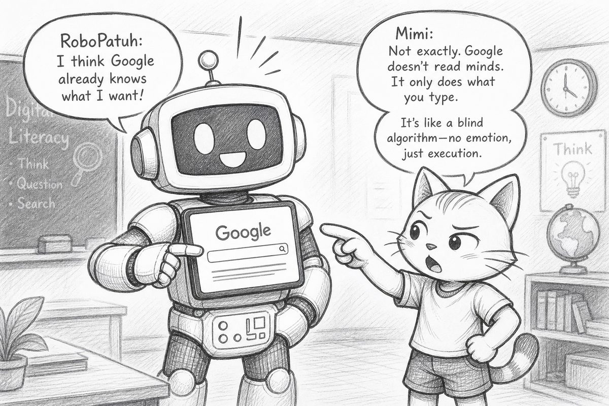
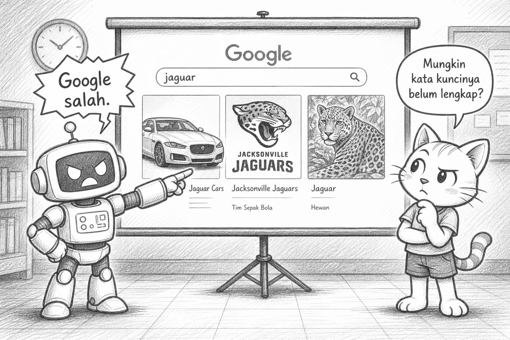
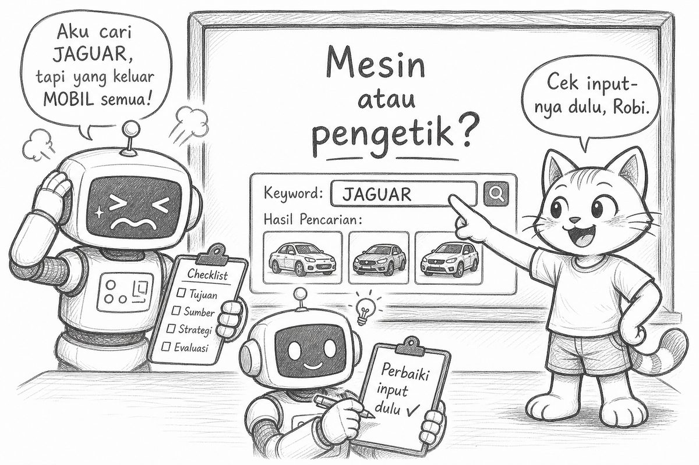
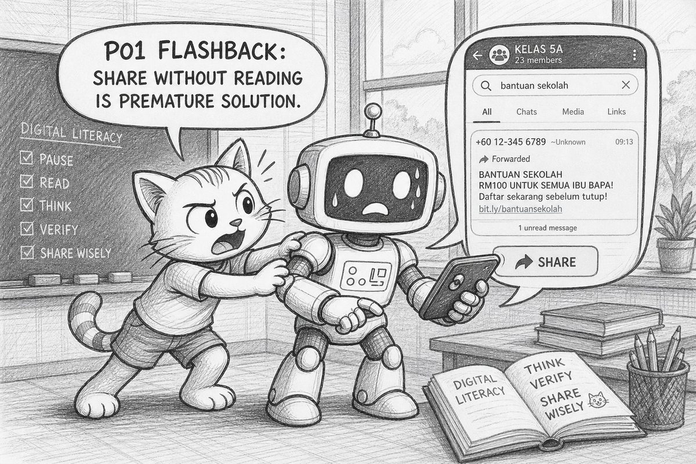
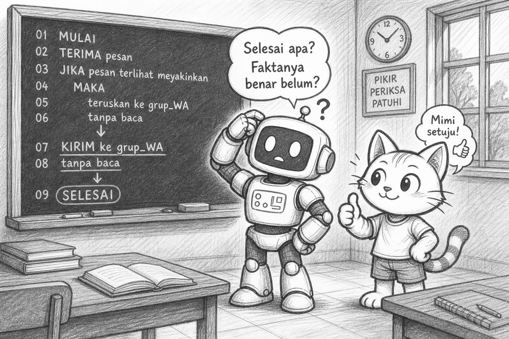
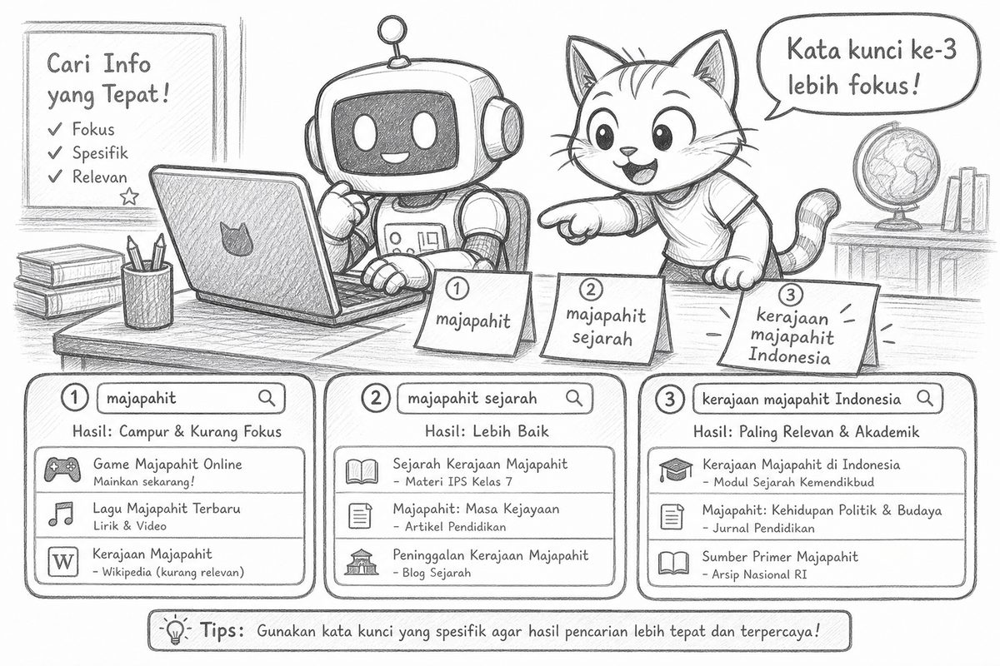
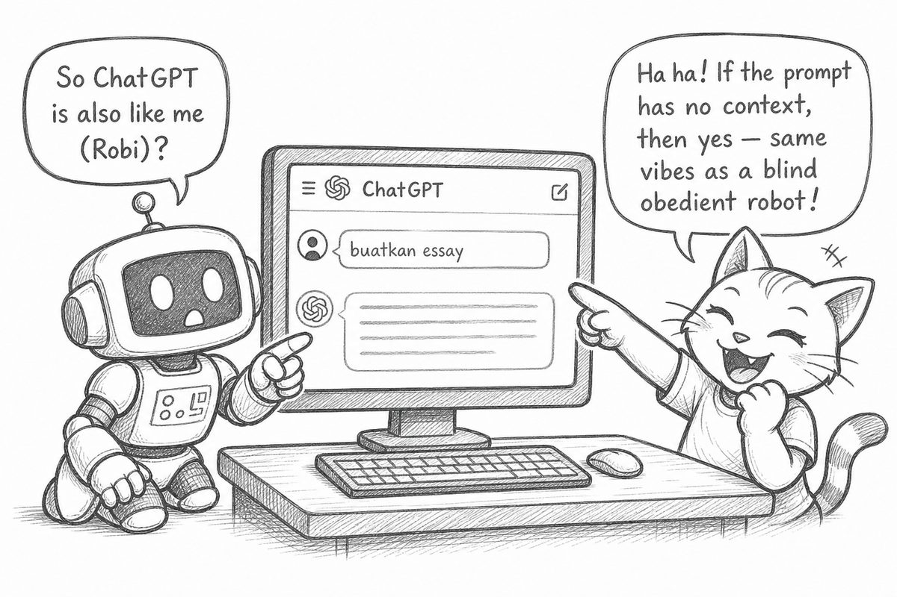

# Bacaan Pendamping — X-S1-P02  
## Mimi & Robi: Google, Jaguar, & Literasi Input

| Field | Isi |
|-------|-----|
| Kode | X-S1-P02 — Google Jaguar & Literasi Input |
| Pertemuan | 2 / 18 |
| Status | Naskah lengkap + ilustrasi dialog — PDF tersedia |
| Nada cerita | POV Mimi, ringan, Gen Z — **pola tetap** |
| PDF | [X-S1-P02_bacaan-mimi-robi.pdf](./X-S1-P02_bacaan-mimi-robi.pdf) |

**Handout konsep:** [X-S1-P02_google-jaguar-literasi_siswa.md](./X-S1-P02_google-jaguar-literasi_siswa.md)

---

Halo lagi. Mimi di sini.

Minggu lalu kita stop dulu sebelum loncat solusi—**masalah sebelum solusi**, ingat? Robi sempat usul helikopter buat antre kantin. Aku pegang papan **KRISIS!**

Hari ini beda kasus, tapi **otak yang sama** yang dilatih:

> Jangan cepat percaya. Cek input dulu.

Robi hari ini bawa laptop (well, tablet mini di dadanya). Excited.

> “Google pasti tahu maksudku.”

Aku:

> “Spoiler: Google itu Robi versi internet. Eksekusi input. Bukan mind reader.”



---

## Opening: recall P01

Guru buka singkat:

> “Satu orang share: **batas masalah** dari minggu lalu + satu hal yang sengaja **belum** diselesaikan.”

Robi volunteer:

> “Batas saya: tidak masukkan mie berbungkus. Belum diselesaikan: cara masak yang benar.”

Close enough.

Guru nyambung:

> “Minggu lalu hoaks WA = solusi prematur. Hari ini: **literasi input**—kata yang kita ketik mengubah ‘kenyataan’ di layar.”

---

## Experience: live search `jaguar`

Guru proyeksikan mesin pencari. Ketik live—**jangan** pakai slide hasil jadi:

**Input 1:** `jaguar`

Hasil campur aduk: mobil, olahraga, hewan macan…  
Kelas: “Kok beda-beda?” “Yang mana yang bener?”

Robi:

> “Google salah.”

Aku angkat alis.

> “Atau… keyword-nya kurang?”



**Input 2:** `jaguar animal`  
→ dominasi hewan.

**Input 3:** `jaguar macan`  
→ lebih spesifik, lebih Indonesia.

**Input 4 (opsional):** `jaguar habitat`  
→ fakta untuk diverifikasi.

Satu kata tambah = halaman beda.  
Output = fungsi dari **input**, bukan “Google baca pikiran kita.”

Kayak P01: solusi absurd muncul karena **masalah belum dibatasi**.  
Hari ini: hasil aneh muncul karena **keyword belum dibatasi**.

---

## Trap: “Google salah” vs “keyword kurang”

Robi frustrasi:

> “Aku mau macan. Google kasih mobil. Google yang error.”

Guru trap:

> “Siapa yang perlu diperbaiki—mesinnya atau pengetiknya?”

Debat singkat. Intinya:

- Yang sering perlu diperbaiki: **kita** (kata kunci, konteks, niat vs ketikan).
- Kecuali: keyword sudah benar tapi **konten** hoaks → verifikasi **isi**, jangan cuma blame Google.

Robi akhirnya nulis di checklist:

> “Perbaiki input dulu.”



Progress.

Varian rotasi kelas paralel (biar gak spoiler):

| Keyword | Ambigu karena… |
|---------|----------------|
| `apple` | Buah vs perusahaan |
| `MA` | Madrasah Aliyah vs gelar vs provinsi |
| `bank` | Sungai vs lembaga keuangan |

Sama trap, kulit beda.

---

## Clarify: jangan cepat percaya

Guru tulis:

> **Jangan cepat percaya.**

Protokol minimal hari ini:

1. Sadar **input persis** apa yang kita kasih mesin.  
2. Bandingkan **2 sumber independen** untuk 1 fakta tugas.  
3. Hasil baris #1 ≠ fakta #1.

Robi hampir screenshot hasil pertama terus share ke grup WA.

Aku tahan cakar.

> “P01 flashback. Share tanpa baca = solusi prematur versi media sosial.”



Robi mundur. Layar keringat digital.

---

## Concept: input · keyword · verifikasi

Baru sekarang nama konsepnya:

| Istilah | Arti singkat |
|---------|--------------|
| **Input → Output** | Mesin pencari output = fungsi dari kata yang diketik |
| **Keyword / disambiguasi** | Tambah kata biar niat jelas (`jaguar macan` ≠ `jaguar car`) |
| **Verifikasi sumber** | 2 sumber independen; sumber terpercaya tergantung konteks (akademik, pemerintah, organisasi resmi) |

Pseudo-algoritme di papan (baca dulu, jangan ketik):

```text
MULAI
  INPUT: kata_kunci = "jaguar"
  CARI di mesin
  AMBIL hasil_baris_1
  KIRIM ke grup_WA tanpa baca
SELESAI
```

Tanya:

- Langkah paling berbahaya? → **KIRIM tanpa baca**  
- Apa yang hilang sebelum CARI? → Verifikasi niat, perbaikan keyword, 2 sumber  
- INPUT = `"MA"` → prediksi? → Madrasah vs gelar vs provinsi  
- Hubung ke P01? → Lompat share = solusi prematur

Robi baca `SELESAI`:

> “Selesai apa? Faktanya benar belum?”



He’s learning. Slowly.

---

## Practice: worksheet 3 keyword

Kalian pilih **topik tugas MA nyata** (bukan jaguar):

1. Tulis pertanyaan tugas 1 kalimat  
2. Coba **3 variasi keyword**  
3. Screenshot hasil terbaik  
4. Temukan **1 sumber kedua** yang verifikasi fakta utama  
5. Catat: beda keyword #1 vs #3?

Robi contoh:

- Tugas: “Sejarah kerajaan Majapahit”  
- Keyword 1: `majapahit` → campur game & wiki  
- Keyword 2: `majapahit sejarah` → lebih akademik  
- Keyword 3: `kerajaan majapahit Indonesia` → lebih fokus  



Jangan copas screenshot teman. Kerjakan sendiri—rule kelas masih berlaku.

---

## Reflect + Transfer

Refleksi 2 kalimat:

> “Kapan aku pernah bilang ‘Google salah’ padahal keyword-ku yang ambigu?”

Transfer:

- **Judul clickbait** = keyword emosional → mesin & otak manusia sama-sama kepicu klik tanpa cek.  
- **Prompt AI singkat** tanpa konteks (preview P03) = input buruk → output ngawur. Sama-sama: **perbaiki input dulu.**

Robi:

> “Jadi ChatGPT juga Robi?”

Aku:

> “Kalau prompt-nya cuma ‘buatkan essay’ tanpa konteks—iya, vibes-nya Robi banget.”



---

## Exit ticket

1. **1 strategi keyword** yang kamu pakai hari ini  
2. **1 sumber terpercaya** untuk topik tugasmu  

Bonus refleksi:
- Satu asumsi yang kubongkar: …  
- Satu hal untuk P03: …

---

## Cek cepat

1. Apa input persis yang kamu kasih mesin tadi?  
2. Apa yang berubah saat satu kata ditambah ke `jaguar`?  
3. Gimana membuktikan fakta baris #1 benar?  
4. Hubungkan ke P01: share hoaks tanpa baca = apa?

---

Satu line buat dibawa pulang:

> **Output = f(input). Verifikasi dulu, baru percaya.**

Sampai P03—Robi sudah janji gak share screenshot tanpa baca. We'll see.

— **Mimi** 🐾  
*(Robi mengetik `jaguar macan` dengan hati-hati.)*

---

## Catatan produksi

- P02: materi pertemuan + ilustrasi dialog Mimi–Robi (`p02-01` … `p02-07`)  
- PDF: `X-S1-P02_bacaan-mimi-robi.pdf`  
- Regenerasi: `06-modules/materi-ajar/scripts/md_to_pdf_bacaan.py`
