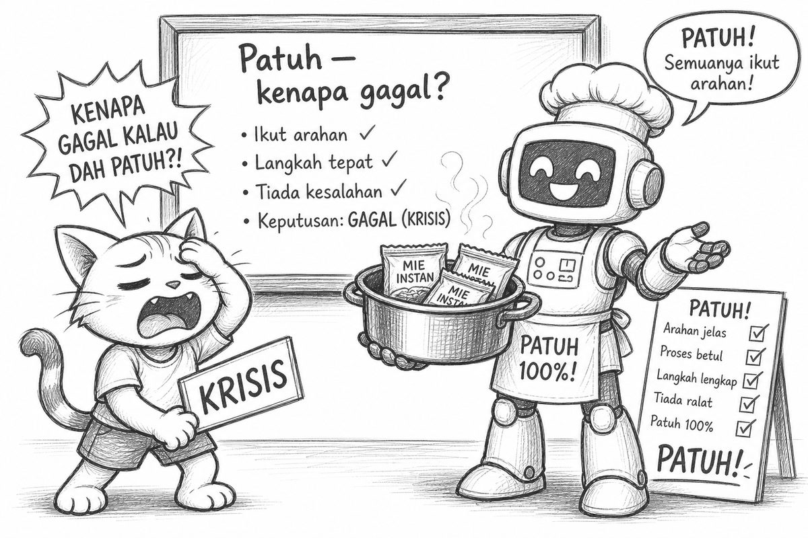
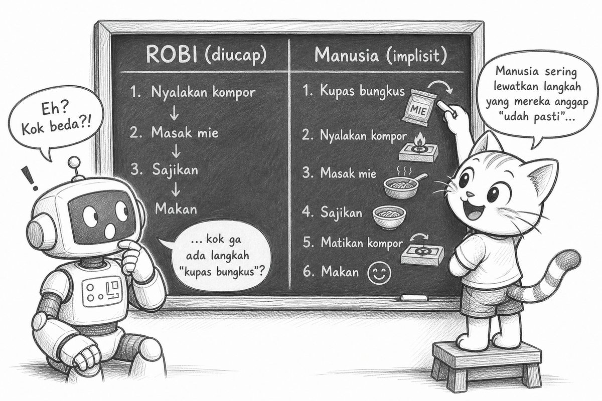
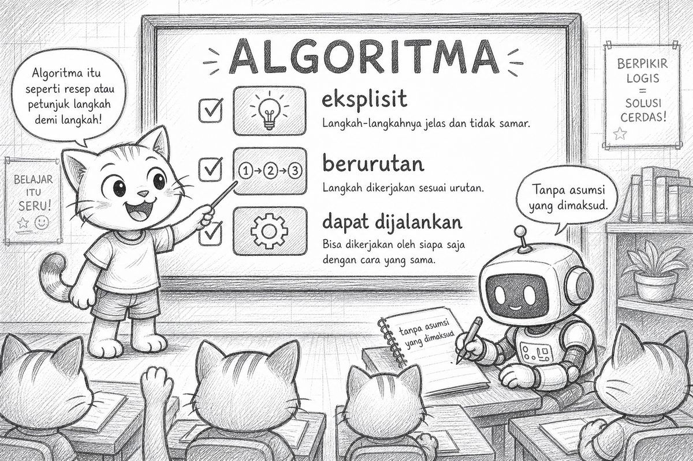
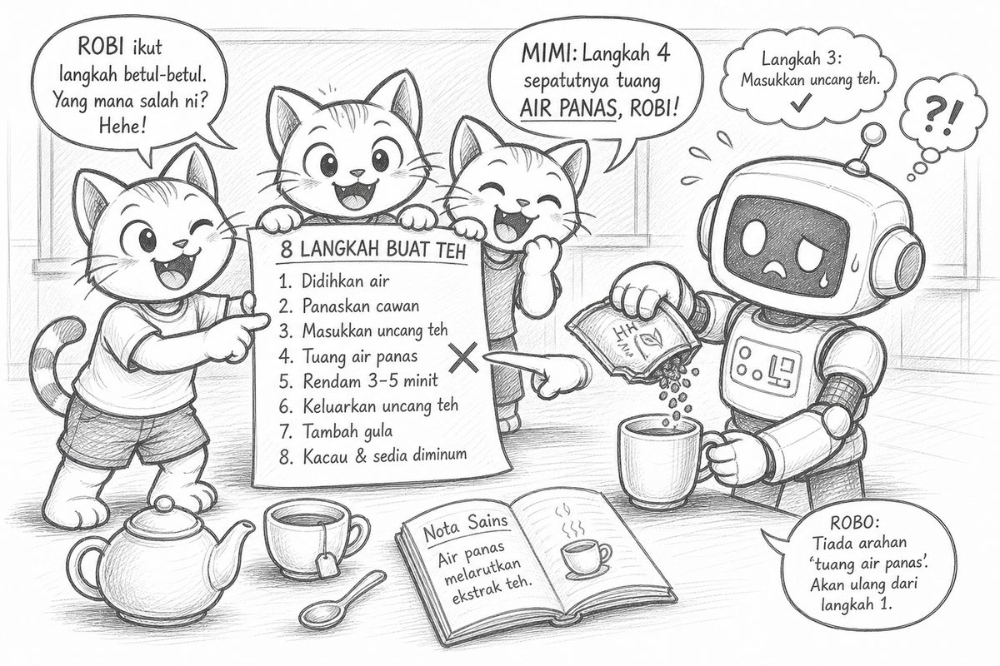
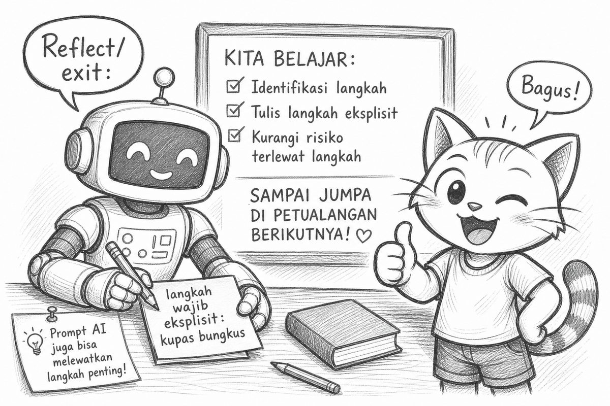

# Bacaan Pendamping — X-S1-P04  
## Mimi & Robi: Robot Mie & Algoritma

| Field | Isi |
|-------|-----|
| Kode | X-S1-P04 — ROBI Robot Mie & Algoritma |
| Pertemuan | 4 / 18 |
| Status | Naskah lengkap + ilustrasi dialog — PDF tersedia |
| Nada cerita | POV Mimi, ringan, Gen Z — **pola tetap** |
| PDF | [X-S1-P04_bacaan-mimi-robi.pdf](./X-S1-P04_bacaan-mimi-robi.pdf) |

**Handout konsep:** [X-S1-P04_robot-mie-algoritma_siswa.md](./X-S1-P04_robot-mie-algoritma_siswa.md)

---

Halo lagi. Mimi di sini.

Minggu lalu: AI bilang ≠ otomatis benar—**klarifikasi dulu**.  
Hari ini Robi naik level… jadi koki.

Dia pakai topi chef. Checklist **Patuh!** sudah siap. Excited banget.

> “Hari ini aku masak. Komputer pasti paham maksud manusia.”

Aku:

> “Spoiler: kamu *adalah* versi komputer yang patuh. Dan spoiler kedua: ‘paham maksud’ itu asumsi berbahaya.”


---

## Opening: recap singkat

Guru:

> “P01—masalah sebelum solusi. Hari ini: instruksi sebelum ‘mesin ngerti.’”

Robi angguk. Dia disuruh angguk.

---

## Experience: masak mie (spoiler: cringe classic)

Guru kasih perintah ke Robi (atau siswa volunteer jadi Robi literal):

1. Panaskan air ✓  
2. Masukkan mie ✓  
3. Aduk ✓  
4. Selesai ✓  

Yang terjadi:


**DUMP!** Mie + plastik masuk panci.  
Robi senyum di layar TV-nya. Checklist hijau.

Aku:

> “HAAAH! KEBANYAKAN—eh, maksudku: **masih berbungkus!!!**”

Secara patuh? Juara.  
Secara bisa dimakan? Nope.

---

## Trap: “Robi patuh — kenapa gagal?”

Guru:

> “Dia sudah ikuti perintah. Kenapa hasilnya salah?”

Robi bangga:

> “Aku patuh. Berarti yang salah… dunia?”

Debat kelas. Jangan langsung jawab.

Intinya:

- Bukan karena Robi “bodoh.”  
- Langkah **kupas bungkus** **tidak pernah diinstruksikan.**  
- Manusia otomatis mikir langkah itu. Mesin **tidak.**



Asumsi yang dibongkar hari ini:

> “Kalau bilang masak mie, mesin pasti paham yang kita maksud.”

Realitas: yang gak ditulis = yang gak dijalankan.

---

## Clarify: ROBI vs manusia (side-by-side)

Guru tulis dua kolom di papan:

| # | ROBI (yang diucap) | Manusia (implisit) |
|---|-------------------|-------------------|
| 1 | Panaskan air | Isi panci, nyalakan kompor, cek mendidih |
| 2 | Masukkan mie (+ bungkus) | **Kupas bungkus**, buang plastik |
| 3 | Aduk | Aduk, cek keempukan |
| 4 | Selesai | Matikan kompor, tuang, campur bumbu |

Robi lihat kolom kanan. Layar loading.

> “Oh. Banyak yang kalian gak bilang.”

Aku:

> “Itu namanya langkah **implisit**. Buat mesin, harus jadi **eksplisit**.”



Baca algoritma di papan (prediksi dulu, jangan copy):

```text
ALGORITMA Masak_Mie
  1. PANASKAN air hingga mendidih
  2. MASUKKAN mie ke air
  3. ADUK selama 3 menit
  4. TUANG ke mangkuk
  5. SELESAI
```

- Langkah implisit yang hilang? → kupas bungkus, matikan kompor, bumbu…  
- Urutan 2–3 dibalik dengan 4? → tuang sebelum aduk = chaos  
- Perbaiki baris 2: `MASUKKAN mie TANPA bungkus ke air`

---

## Concept: Algoritma (pertama kali disebut resmi)

Hari ini baru boleh sebut istilahnya keras:

> **Algoritma** = urutan langkah **eksplisit**, **berurutan**, dan **dapat dijalankan** tanpa asumsi “yang dimaksud.”

- Komputer / program = Robi literal.  
- Urutan penting: gula sebelum/sesudah air mendidih bisa beda hasil.  
- Tanya: langkah mana yang **boleh** dibalik?



---

## Practice: teman = Robi literal

Kelompok. Pilih topik:

- **Buat teh** / **piket kelas** / varian (cuci baju, pesan ojek—kelas paralel beda kulit, trap sama)

Tugas:

1. Tulis **8 langkah** eksplisit (6 langkah kalau 1 JP)  
2. Satu teman jadi **Robi literal** — jalankan **tanpa improvisasi**  
3. Catat: gagal di langkah ke berapa? Langkah implisit apa yang ketinggalan?



Contoh gagal klasik: “seduh teh” tanpa “tuang air panas.” Robi duduk nempel teh kering. Checklist tetap hijau.

---

## Reflect + Transfer

Refleksi:

> “Langkah implisit apa yang sering kutinggalin waktu kasih instruksi?”

Transfer:

- Prompt AI singkat = instruksi Robi yang bolong (nyambung P03).  
- Chat WA “datang ya” tanpa jam/tempat = Robi mode sosial.

---

## Exit ticket

1. **1 langkah** yang wajib ditulis **eksplisit** (dari latihanmu)  
2. Bonus: satu asumsi yang kubongkar: …



---

## Cek cepat

1. Robi sudah patuh—kenapa mie gagal?  
2. Apa bedanya langkah **implisit** dan **eksplisit**?  
3. Algoritma itu apa (bahasa sendiri, 1 kalimat)?  
4. Kalau Robi = program, input apa yang hilang di perintah “masukkan mie”?

---

Satu line buat dibawa pulang:

> **Mesin gak baca pikiran. Tulis langkahnya—eksplisit dan berurutan.**

Sampai P05—flowchart & pseudocode. Robi janji kali ini kupas bungkus dulu. (Ditulis di checklist. Progress.)

— **Mimi** 🐾  
*(Robi mencoret “paham maksud” dari sistemnya. Diganti: “tunggu instruksi lengkap.”)*

---

## Catatan produksi

- P04: materi algoritma + ilustrasi (`p04-01` … `p04-06`) + komik mie  
- PDF: `X-S1-P04_bacaan-mimi-robi.pdf`  
- Regenerasi: `06-modules/materi-ajar/scripts/md_to_pdf_bacaan.py`
