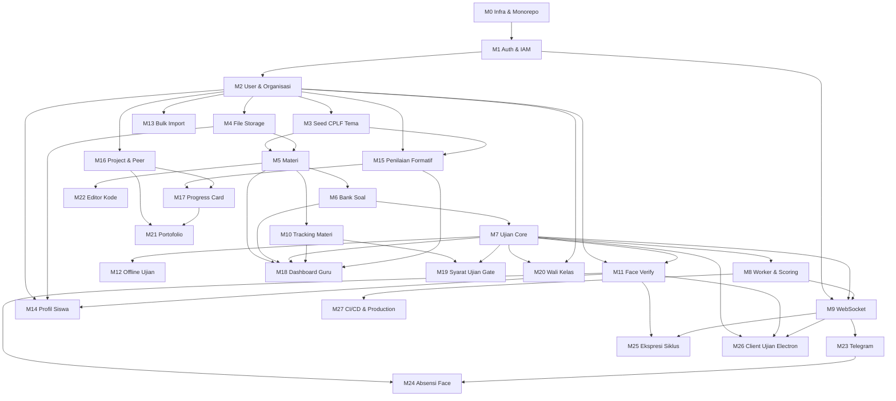

# 27. Dev Todo List per Modul

> **Dokumen tracking sebelum coding.** Centang `[x]` saat selesai. Urutan mengikuti **dependency chain** — modul di atas harus minimal MVP-nya selesai sebelum modul di bawahnya bisa diintegrasi penuh.

**Cara pakai:**
1. Kerjakan **berurutan per Blok** (M0 → M1 → …).
2. Di dalam modul, kerjakan task **BE → FE → Integrasi → UAT**.
3. Jangan loncat blok kecuali task paralel (ditandai ⚡).

**Status:** `[ ]` belum · `[~]` in progress · `[x]` selesai · `[-]` skip/defer

---

## 0. Peta Dependency (baca dulu)

---

## 1. Urutan Eksekusi Global (Ringkas)

| Blok | Modul | Fase | Blocker untuk | Prioritas |
|------|-------|------|---------------|-----------|
| **M0** | Infra & Monorepo | 0 | Semua | 🔴 P0 |
| **M1** | Auth & IAM | 0 | Semua endpoint auth | 🔴 P0 |
| **M2** | User & Organisasi (Kelas/Mapel) | 0–1 | Materi, ujian, siswa | 🔴 P0 |
| **M3** | Seed CPLF 108 Tema | 1 | Navigasi CPLF, formatif | 🔴 P0 |
| **M4** | File Storage (disk lokal / R2) | 1 | Gambar materi, foto profil | 🟠 P1 |
| **M5** | Materi Pembelajaran | 1 | Tracking, gate ujian | 🔴 P0 |
| **M6** | Bank Soal | 1 | Ujian | 🔴 P0 |
| **M7** | Ujian Core (CRUD + sesi acak) | 1 | Worker, offline, statistik | 🔴 P0 |
| **M8** | Worker & Scoring | 1 | Hasil ujian realtime | 🔴 P0 |
| **M9** | WebSocket Realtime | 0–1 | Notif, dashboard live | 🟠 P1 |
| **M10** | Tracking Aktivitas Materi | 2 | Gate ujian, dashboard | 🟠 P1 |
| **M11** | Verifikasi Wajah | 2 | Ujian secure, absensi | 🟠 P1 |
| **M12** | Ujian Offline-First | 2 | Lab jaringan buruk | 🟠 P1 |
| **M13** | Bulk Import Siswa | 3 | Onboarding kelas nyata | 🟠 P1 |
| **M14** | Profil Siswa | 3 | Git URL, face enroll | 🟠 P1 |
| **M15** | Penilaian Formatif | 1b | Progress card, CPLF | 🟠 P1 |
| **M16** | Project & Peer Review | 1b | Progress card, portofolio | 🟡 P2 |
| **M17** | Progress Card | 1b | Portofolio | 🟡 P2 |
| **M18** | Dashboard Guru | 1b–3 | Operasional harian guru | 🟠 P1 |
| **M19** | Syarat Ujian (gate materi) | 6 | Integritas belajar | 🟡 P2 |
| **M20** | Wali Kelas | 6 | Rekap lintas mapel | 🟡 P2 |
| **M21** | Portofolio Siswa | 5 | Showcase XII | 🟢 P3 |
| **M22** | Editor Kode (Monaco) | 6 | Practice JS | 🟡 P2 |
| **M23** | Notifikasi Telegram | 7 | Push luar app | 🟡 P2 |
| **M24** | Absensi Face (kiosk) | 7 | Operasional MA | 🟡 P2 |
| **M25** | Ekspresi Siklus Belajar | 6 | Evaluasi kelas | 🟢 P3 |
| **M26** | Client Ujian Electron | 6 | Ujian secure | 🟢 P3 |
| **M27** | CI/CD & Production | 4 | Go-live | 🟠 P1 |

**MVP usable di kelas:** M0–M8 + M13 (import siswa) = guru bisa materi, ujian, nilai.  
**MVP CPLF lengkap:** + M3, M10, M15, M18.  
**Production-ready:** + M11, M12, M27.

---

## 2. Todo per Modul

### M0 — Infra & Monorepo
**Dok:** 01, 13 · **Fase:** 0 · **Estimasi:** 2–3 hari

- [x] Init monorepo (`npm` workspaces: `apps/api`, `apps/web`, `packages/shared`)
- [~] Setup dev **native** (PostgreSQL + Redis lokal/WSL — **tanpa Docker**)
- [x] Folder `deploy/`: contoh Nginx, PM2 ecosystem, script backup
- [x] NestJS skeleton + global ValidationPipe + exception filter
- [~] Next.js App Router skeleton + Tailwind + shadcn/ui base
- [x] `packages/shared`: types dasar, constants role, API response shape
- [x] Env template (`.env.example`) BE & FE
- [x] Script `dev` parallel (api + web)
- [x] README setup lokal (install PG/Redis → migrate → seed → npm run dev)

**DoD:** PostgreSQL + Redis native jalan + `pnpm dev` → API health OK, FE landing render.

---

### M1 — Auth & IAM
**Dok:** 02 · **Fase:** 0 · **Depends:** M0

#### BE
- [x] Prisma: User, Role, Permission, UserRole, RolePermission, RefreshToken
- [x] Seed: SUPER_ADMIN, ADMIN, GURU, MURID + permissions dasar
- [x] AuthModule: login, refresh, logout, `/auth/me`
- [x] JWT httpOnly cookie (access + refresh), CORS credentials
- [x] JwtAuthGuard, RolesGuard, PermissionsGuard
- [x] `@RequirePermissions()`, `@CurrentUser()` decorators
- [x] IamModule: list roles/permissions (admin)
- [x] `tokenVersion` invalidasi + mustChangePassword flag

#### FE
- [x] Axios client + interceptor refresh 401
- [x] Login page `(auth)/login`
- [x] Ganti password paksa `(auth)/ganti-password`
- [x] Auth context / hook `useAuth`
- [x] Route guard client-side (redirect jika belum login)

#### UAT
- [ ] Login admin → akses endpoint protected
- [ ] Logout → cookie cleared
- [ ] Role MURID ditolak endpoint `user:create`

**DoD:** Admin login, CRUD role permission read, murid login terpisah.

---

### M2 — User & Organisasi
**Dok:** 02, 03 · **Fase:** 0–1 · **Depends:** M1

#### BE
- [x] Prisma: Kelas, Mapel, GuruMapelKelas, ProfilSiswa, ProfilGuru
- [x] UserModule: CRUD user single (admin)
- [x] KelasModule: CRUD kelas, assign siswa ke kelas
- [x] MapelModule + Tema stub (CRUD tanpa seed dulu)
- [x] GuruMapelKelas: assign guru ↔ mapel ↔ kelas
- [~] OwnershipScopeGuard (guru hanya kelas/mapellnya)

#### FE
- [x] Admin: kelola user, kelas, mapel
- [x] Admin: assign guru mapel kelas
- [~] Guru: lihat daftar kelas diampu

#### UAT
- [ ] Buat kelas X-A, mapel Multimedia, 2 user guru+murid
- [ ] Guru A tidak akses kelas Guru B

**DoD:** Struktur organisasi sekolah tercatat di DB + UI admin.

---

### M3 — Seed CPLF 108 Tema
**Dok:** 16 · **Fase:** 1 · **Depends:** M2 · ⚡ paralel dengan M4

- [x] Script parse `06-modules` + RPP KBC → JSON `tema-cplf.json`
- [x] Perluas model Tema: kodeModulCplf, capabilityCodes, aspekFormatifFokus, semester, tingkat, urutanGlobal
- [x] Seed idempotent `npm run db:seed:tema`
- [x] Seed CapabilityDef (CX-, CXI-, CXII-)
- [x] API: GET `/tema?mapelId=&semester=&tingkat=`
- [x] FE: navigasi semester → 18 pertemuan (read-only list)

**DoD:** 108 tema tampil di UI guru; metadata P01 capability/aspek terisi.

---

### M4 — File Storage
**Dok:** 01, 07 · **Fase:** 1 · **Depends:** M0 · ⚡ paralel M3

- [x] FileModule: upload ke disk lokal (`uploads/`) dev / Cloudflare R2 prod (Multer)
- [x] Endpoint upload gambar (auth + permission)
- [ ] Sharp resize thumbnail (opsional MVP)
- [x] FE: komponen upload + preview URL

**DoD:** Upload gambar → URL publik/presigned → tampil di FE.

---

### M5 — Materi Pembelajaran
**Dok:** 07 · **Fase:** 1 · **Depends:** M3, M4

#### BE
- [x] Prisma: Materi (contentJson, status DRAFT/PUBLISHED)
- [x] MateriModule: CRUD + publish/archive
- [x] Slug unique per materi
- [x] Scope: guru kelas/mapellnya, murid kelasnya (published only)

#### FE
- [x] Tiptap editor block-based (heading, paragraph, code, video, image, list) — MVP BlockEditor custom
- [x] Video embed YouTube (direct client, no proxy)
- [ ] Code block Shiki/Prism read-only di renderer
- [x] Guru: buat/edit/publish materi per tema
- [x] Murid: baca materi `/materi/[slug]`

#### UAT
- [ ] Guru publish materi P01 → murid kelas X-A bisa baca
- [ ] Murid kelas lain tidak bisa akses

**DoD:** Alur materi CPLF digital jalan (minimal 1 pertemuan end-to-end).

---

### M6 — Bank Soal
**Dok:** 04 · **Fase:** 1 · **Depends:** M3

#### BE
- [x] Prisma: Soal, PilihanJawaban, enums tipe/tingkat
- [x] BankSoalModule: CRUD + soft delete
- [x] Filter per temaId, isActive
- [x] Murid **tidak** bisa list bank soal langsung

#### FE
- [x] Guru: list/create/edit soal per tema
- [x] Form pilihan ganda dinamis (4 opsi, 1 benar)
- [ ] Preview soal (guru)

**DoD:** Min. 5 soal per tema bisa dibuat; data siap untuk ujian.

---

### M7 — Ujian Core
**Dok:** 04 · **Fase:** 1 · **Depends:** M6, M2

#### BE
- [ ] Prisma: Ujian, UjianSesi, UjianSesiSoal, JawabanSiswa
- [ ] Create ujian draft (jumlahSoal, durasi, waktu, flags acak)
- [ ] Publish: generate UjianSesi + UjianSesiSoal acak per siswa kelas
- [ ] Acak urutan soal & pilihan per sesi
- [ ] Endpoints: mulai sesi, get soal sesi, submit batch
- [ ] Murid: list ujian aktif

#### FE
- [ ] Guru: wizard buat ujian → publish
- [ ] Murid: daftar ujian aktif
- [ ] Murid: halaman kerjakan ujian (timer, navigasi soal)
- [ ] Submit konfirmasi

#### UAT
- [ ] 2 murid dapat paket soal urutan berbeda
- [ ] Submit → status MENUNGGU_PROSES

**DoD:** Ujian refleksi acak per siswa bisa dikerjakan (belum dinilai otomatis).

---

### M8 — Worker & Scoring
**Dok:** 10 · **Fase:** 1 · **Depends:** M7, M0 (Redis)

- [ ] BullMQ setup + queue `ujian-scoring`
- [ ] Processor: score PG/Benar-Salah, esai pattern basic
- [ ] Update JawabanSiswa, UjianSesi.nilaiAkhir, status SELESAI
- [ ] Retry 3× + failed state
- [ ] Statistik dasar: GET `/statistik/ujian/:id`

#### FE
- [ ] Murid: halaman hasil (setelah SELESAI)
- [ ] Guru: statistik ujian (rata-rata, distribusi)

**DoD:** Submit ujian → worker → nilai muncul < 30 detik.

---

### M9 — WebSocket Realtime
**Dok:** 08 · **Fase:** 0–1 · **Depends:** M1 · ⚡ paralel setelah M1

- [ ] Socket.IO gateway NestJS + Redis adapter
- [ ] JWT auth handshake WS
- [ ] Rooms: `user:{id}`, `kelas:{id}`, `ujian:{id}`
- [ ] Events: `ujian:selesai`, `notifikasi:baru`
- [ ] FE: `lib/ws` client + hook `useWebSocket`
- [ ] Integrasi: worker emit `ujian:selesai` ke murid

**DoD:** Murid terima nilai ujian tanpa refresh halaman.

---

### M10 — Tracking Aktivitas Materi
**Dok:** 11 · **Fase:** 2 · **Depends:** M5

- [ ] Prisma: AktivitasMateri
- [ ] Endpoints: kunjungan, heartbeat, leave
- [ ] FE: `useActivityTracker` (scroll, durasi, debounce flush)
- [ ] Notif first-visit consent tracking
- [ ] Guru: statistik materi per siswa/kelas

**DoD:** Guru lihat siapa baca materi P07 & scroll %.

---

### M11 — Verifikasi Wajah
**Dok:** 05 · **Fase:** 2 · **Depends:** M2, M14 (partial)

- [ ] Prisma: FaceEmbedding
- [ ] BE: enrollment store, reference get, verify log
- [ ] FE: load face-api models (cache IndexedDB)
- [ ] Enrollment flow di profil
- [ ] Pre-ujian verify jika `wajibVerifikasiWajah`
- [ ] Integrasi UjianSesi.faceVerifiedAt

**DoD:** Siswa enroll wajah → ujian wajib verify → sesi tercatat.

---

### M12 — Ujian Offline-First
**Dok:** 09 · **Fase:** 2 · **Depends:** M7

- [ ] Dexie schema: cached soal, jawaban draft, pending submit
- [ ] Cache soal saat mulai ujian online
- [ ] Simpan jawaban lokal tiap perubahan
- [ ] Auto-sync queue saat online
- [ ] UI indicator offline/syncing

**DoD:** Kerjakan ujian offline → online → jawaban ter-submit otomatis.

---

### M13 — Bulk Import Siswa
**Dok:** 06 · **Fase:** 3 · **Depends:** M2

- [ ] Template CSV download
- [ ] FE: PapaParse preview + validasi
- [ ] BE: enqueue import job (BullMQ)
- [ ] Worker: create User + ProfilSiswa, password=NIS hash, mustChangePassword
- [ ] Status job + error report per baris
- [ ] AuditLog BULK_IMPORT

**DoD:** Import 30 siswa CSV → login NIS → ganti password.

---

### M14 — Profil Siswa
**Dok:** 12 · **Fase:** 3 · **Depends:** M2, M4, M11

- [ ] Endpoint GET/PATCH profil, ganti password, upload foto
- [ ] Field: urlGit, kontakOrangTua, ekspresiOptOut
- [ ] FE halaman profil murid/guru
- [ ] Validasi URL Git

**DoD:** Siswa update profil + foto + URL Git.

---

### M15 — Penilaian Formatif
**Dok:** 17 · **Fase:** 1b · **Depends:** M3, M2

- [ ] Prisma: PenilaianFormatif, PenilaianFormatifSiswa
- [ ] CRUD sesi formatif per tema+kelas
- [ ] Batch upsert skor 2–3 aspek
- [ ] Finalize lock sesi
- [ ] FE: FormatifChecklistTable + tooltip deskriptor aspek
- [ ] Pre-fill aspek fokus dari Tema.aspekFormatifFokus

**DoD:** Guru isi ceklis REA+OBS P01 untuk 1 kelas dalam < 5 menit.

---

### M16 — Project & Peer Review
**Dok:** 18 · **Fase:** 1b · **Depends:** M2, M3

- [ ] Seed ProjectDef dari 08-project bank
- [ ] Assignment, submission, DoD gate, penilaian 6 aspek
- [ ] PeerReview + revisi reviewee
- [ ] Skor etika E1–E4 (XII) — schema ready
- [ ] FE guru: penilaian project; murid: submit + peer form

**DoD:** 1 project semester assign → submit → guru nilai + narasi.

---

### M17 — Progress Card
**Dok:** 19 · **Fase:** 1b · **Depends:** M15, M16

- [ ] Prisma: ProgressCard, ProgressCardItem
- [ ] Generate draft kelas + auto-suggest dari formatif/project
- [ ] Guru override + finalize
- [ ] Murid self-assessment narasi
- [ ] Export PDF (defer OK jika belum)

**DoD:** Kartu capability S1 siswa terisi minimal 5 baris.

---

### M18 — Dashboard Guru
**Dok:** 21 · **Fase:** 1b–3 · **Depends:** M5, M7, M10, M15

- [ ] Aggregator endpoint `/dashboard/guru`
- [ ] Widget: pertemuan aktif, progress 18 tema, project, alerts
- [ ] Alert rules (materi belum dibaca, formatif belum diisi)
- [ ] FE dashboard layout + drill-down

**DoD:** Guru buka dashboard → lihat status P08 + alert siswa.

---

### M19 — Syarat Ujian (Gate Materi)
**Dok:** 04 §6 · **Fase:** 6 · **Depends:** M10, M7

- [ ] Field Ujian.syaratPartisipasi JSON
- [ ] GET `/ujian/:id/eligibility`
- [ ] POST override per siswa (guru)
- [ ] FE: blok mulai ujian + progress bar syarat
- [ ] Link redirect ke materi

**DoD:** Ujian dengan syarat scroll 70% → murid belum baca ditolak.

---

### M20 — Wali Kelas
**Dok:** 02 §4.1 · **Fase:** 6 · **Depends:** M7, M2

- [ ] Role WALI_KELAS seed + Kelas.waliKelasId
- [ ] WaliKelasModule + scope guard
- [ ] Endpoints rekap nilai ujian lintas mapel
- [ ] FE menu Wali Kelas terpisah

**DoD:** Wali kelas lihat nilai ujian murid X-A semua mapel (read-only).

---

### M21 — Portofolio Siswa
**Dok:** 20 · **Fase:** 5 · **Depends:** M16, M17, M14

- [ ] PortofolioSiswa model + agregat view
- [ ] FE edit narasi + featured projects
- [ ] Publish + visibilitas tier
- [ ] Showcase list per kelas

**DoD:** Siswa XII publish portofolio 3 tahun.

---

### M22 — Editor Kode (Monaco)
**Dok:** 24 · **Fase:** 6 · **Depends:** M5

- [ ] Block type `code_practice` di materi
- [ ] CodeSnippet model + autosave API
- [ ] Monaco + iframe sandbox runner
- [ ] Console output panel
- [ ] (Defer) subprocess sandbox ujian coding — browser sandbox cukup MVP

**DoD:** Murid edit JS di materi P10 → Run → lihat output.

---

### M23 — Notifikasi Telegram
**Dok:** 25 · **Fase:** 7 · **Depends:** M9 (events)

- [ ] Bot Telegram + env token
- [ ] Link akun deep link flow
- [ ] TelegramLink + preferensi
- [ ] NotifikasiOutbox + worker send
- [ ] Templates: ujian reminder, hasil, deadline project
- [ ] (Defer) orang tua link

**DoD:** Siswa link Telegram → terima reminder ujian.

---

### M24 — Absensi Face Recognition
**Dok:** 26 · **Fase:** 7 · **Depends:** M11, M3

- [ ] SesiAbsensi + AbsensiRecord
- [ ] Kiosk device token auth
- [ ] Roster cache embeddings per sesi
- [ ] FE kiosk `/kiosk/absensi/:sesiId`
- [ ] Guru: open/close sesi, override manual, rekap
- [ ] Integrasi Telegram ABSENSI_MASUK (jika M23)

**DoD:** 32 siswa absen via kiosk < 5 menit; guru tidak panggil nama.

---

### M25 — Ekspresi Siklus Belajar
**Dok:** 23 · **Fase:** 6 · **Depends:** M11, M9

- [ ] SiklusBelajar + EkspresiSample models
- [ ] Mode STUDENT_DEVICE + GURU_CAMERA
- [ ] Guru: start/fase/end + capture snapshot
- [ ] Timeline agregat kelas
- [ ] (Defer) student continuous sampling

**DoD:** Guru mode GURU_CAMERA → Trap → capture → timeline 🤔 dominan.

---

### M26 — Client Ujian Electron
**Dok:** 22 · **Fase:** 6 · **Depends:** M7, M11, M9

- [ ] Electron app shell + auth bridge
- [ ] Fullscreen + disable devtools saat ujian
- [ ] Proctor heartbeat + ProctorEventLog
- [ ] requiresSecureClient flag di ujian
- [ ] (Defer) React Native Android

**DoD:** Ujian secure hanya bisa dibuka via Electron; kamera monitored.

---

### M27 — CI/CD & Production (VPS + Vercel)
**Dok:** 01 §6, 15 Fase 4 · **Fase:** 4 · **Depends:** MVP M0–M8

- [ ] GitHub Actions: lint, test, build (no container build)
- [ ] Deploy FE: Vercel project linked repo `apps/web`
- [ ] Deploy BE: script SSH `deploy-api.sh` → build → `pm2 reload`
- [ ] VPS setup: Nginx + TLS (Certbot), PostgreSQL, Redis native
- [ ] PM2 ecosystem API + worker
- [ ] Swagger `/api/docs` (staging only)
- [ ] `pg_dump` backup cron + logrotate
- [ ] Uptime monitor `/health`
- [ ] Load test ujian 50 siswa serentak

**DoD:** Push main → Vercel deploy FE + SSH deploy BE → smoke test pass.

---

## 3. Milestone Checklist (Executive)

| Milestone | Modul minimal | Target |
|-----------|---------------|--------|
| **Alpha** | M0–M2 | Login + struktur kelas |
| **Beta LMS** | M0–M8, M13 | Materi + ujian + import siswa |
| **Beta CPLF** | + M3, M10, M15, M18 | Formatif + dashboard + tracking |
| **RC1** | + M11, M12, M27 | Face, offline, staging live |
| **v1.0** | + M16, M17, M14 | Project + progress card |
| **v1.x** | + M19–M26 | Fitur lanjutan per prioritas MA |

---

## 4. Task Paralel Aman (⚡)

Tim 2+ developer bisa paralel hanya pada:

| Dev A | Dev B | Syarat |
|-------|-------|--------|
| M3 Seed tema | M4 File storage | M2 selesai |
| M6 Bank soal | M9 WebSocket | M1 selesai |
| M10 Tracking | M11 Face (BE schema) | M5 selesai |
| M15 Formatif | M16 Project | M3 selesai |
| M23 Telegram | M24 Absensi (tanpa TG) | M11 selesai |

**Jangan paralel:** M7 tanpa M6; M8 tanpa M7; M17 tanpa M15.

---

## 5. Log Progress (isi manual)

| Tanggal | Modul | Task selesai | Catatan |
|---------|-------|--------------|---------|
| | | | |

---

## 6. Referensi Silang

- Roadmap fase → [15_Roadmap_Implementasi.md](./15_Roadmap_Implementasi.md)
- Struktur folder kode → [13_Struktur_Proyek.md](./13_Struktur_Proyek.md)
- API contract → [14_API_Contract_Overview.md](./14_API_Contract_Overview.md)
- Entry point → [README.md](./README.md)
